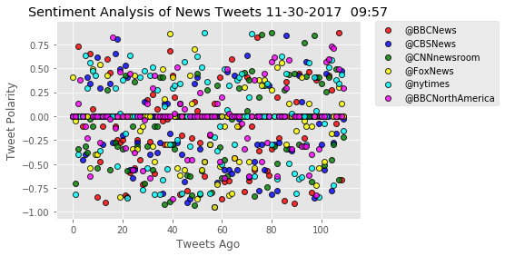
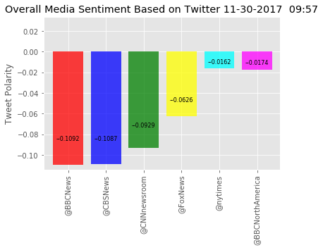

# Unit 7 Homework - Sentiment Analysis of News Tweets

This script pulls 110 recent tweets from 6 different news agencies and runs a Vader Sentiment Analysis to determine the positive/negative nature of the tweet.

Following are my observations of the data:
1)	The Scatter plot shows a wide spread of positive vs negative comments with a solid neutral representation.  I feel that this shows an overall balanced representation of current events by each news agency.  When you then look at the bar chart of average compound score you see how very close to zero they all are.

2)	I included the BBC feed for both Britton and North America.  When you compare the two, you see a fairly significant difference.  The British feed is almost 50% more negative, while the neutral and positive are very close.  This generates a significantly different compound score of -.109 for the British feed (the most negative of the feeds) vs a -.017 for the North American feed (second most positive).  This could be either a bias toward more negative news or that North American news is currently more positive than British news right now.


3)	I ran this script numerous times.  It produces a very small snapshot of data that looks VERY different every time you run it.  To really be able to analyze this, you would need to pull numerous data points over a period of time to see if there is any bias b


```python
# Dependencies
import tweepy
import numpy as np
import pandas as pd
# Import and Initialize Sentiment Analyzer
from vaderSentiment.vaderSentiment import SentimentIntensityAnalyzer
analyzer = SentimentIntensityAnalyzer()
from datetime import datetime
import matplotlib.pyplot as plt
from matplotlib import style
style.use('ggplot')
# Twitter API Keys
from key_vault import (consumer_key, 
                    consumer_secret, 
                    access_token, 
                    access_token_secret)

# Setup Tweepy API Authentication
auth = tweepy.OAuthHandler(consumer_key, consumer_secret)
auth.set_access_token(access_token, access_token_secret)
api = tweepy.API(auth, parser=tweepy.parsers.JSONParser())
```


```python
# Target Search Term, BBC, CBS, CNN, Fox & NY Times
target_user = ("@BBCNews", "@CBSNews", "@CNNnewsroom",
                "@FoxNews", "@nytimes", "@BBCNorthAmerica")

# Array to hold sentiment & set up counter
sentiments = []
number_of_tweets= 110
# loop through the target users

for target in target_user:
    counter = 1
    # Get all tweets from home feed
    public_tweets = api.user_timeline(target, count= number_of_tweets)

    # Loop through all tweets 
    for tweet in public_tweets:

        # Print Tweets
        print("Tweet %s: %s" % (counter, tweet["text"]))
      
        # Run Vader Analysis on each tweet
        results = analyzer.polarity_scores(tweet["text"])
        compound = results["compound"]
        pos = results["pos"]
        neu = results["neu"]
        neg = results["neg"]
        tweets_ago = counter
        
        # Add sentiments for each tweet into an array
        sentiments.append({"Date": tweet["created_at"], 
                           "Source": target,
                           "Compound": compound,
                           "Positive": pos,
                           "Negative": neg,
                           "Neutral": neu,
                           "Text": tweet['text'],
                           "Tweets Ago": counter})
        
        # Add to counter 
        counter = counter + 1


   
```

    Tweet 1: Lord Balfour says one of his daughters could declare herself male to inherit his title https://t.co/cZ5xSvFdci
    Tweet 2: RT @BBCBreaking: White House discussing plan to replace Secretary of State Rex Tillerson with CIA chief Mike Pompeo - US media https://t.co…
    Tweet 3: Charities see increase in dogs being dumped or sent to rescue centres as Christmas approaches https://t.co/D7zgMkNz4l
    Tweet 4: Girls could inherit if they change gender, says Earl https://t.co/zuAxgUYoQa
    Tweet 5: Sammy Wilson warns Brexit talks may jeopardise DUP-Tory deal https://t.co/8XJe8mlTSQ
    Tweet 6: RT @BBCEarth: Run little crab, run! 🦀 🐍 🐙
    #BluePlanet2 https://t.co/4VTeteXJnv
    Tweet 7: RT @bbcweather: Wondering if it will #snow where you are later? Here's a snapshot of the forecast from 6pm through to early tomorrow. Jo #S…
    Tweet 8: Millions of iPhone users could get "several hundred pounds each" if a legal case against @Google is successful 
    
    Fi… https://t.co/VG0cnznOp0
    Tweet 9: RT @BBCMarkSimpson: Warning to the Government on Brexit from the party that’s keeping them in power,  the DUP. https://t.co/g9AMI52mCm
    Tweet 10: RT @bbcweather: Christmas card scenes in some parts of the UK today. Here are few shots of the #snow posted by our Weather Watchers. Thanks…
    Tweet 11: RT @BBCEngland: A suspected World War Two bomb found by local divers is thought to be a parachute mine, coastguards say https://t.co/Yc8g5h…
    Tweet 12: RT @BBCBreaking: UK Prime Minister Theresa May tells Donald Trump "retweeting from Britain First was the wrong thing to do" https://t.co/eX…
    Tweet 13: RT @BBCRealityCheck: If nobody wants a hard border, why is the Northern Ireland #Brexit issue so fraught? @BBCChrisMorris explains  https:/…
    Tweet 14: RT @BBCEngland: A stolen laptop that belonged to a teenager who died from cancer is handed into police https://t.co/3Il6HMzXbG https://t.co…
    Tweet 15: RT @AlexForsythBBC: PM just started speaking in Jordan - focus of this trip about  strengthening friendship &amp; support but expect Qs about P…
    Tweet 16: RT @BBCNewsbeat: The Duke of Cambridge has given Prince George's Christmas wish list to Santa Claus in Finland - and he wants a police car!…
    Tweet 17: RT @BBCSport: The World Cup draw takes place at 15:00 GMT tomorrow and it's live on BBC Two!
    
    Here's all you need to know...
    
    More: https:/…
    Tweet 18: Shell's gender pay audit reveals women paid 22% less than men https://t.co/xmmHWrPy5B
    Tweet 19: Care homes: Self-funders hit by unfair charges and fees - watchdog https://t.co/NuYWCXkUrn
    Tweet 20: RT @BBCScienceNews: Early baldness higher heart disease risk factor than obesity, says study https://t.co/E9pl42H3td
    Tweet 21: Rogue states &amp; terrorists will get their hands on lethal artificial intelligence "in the very near future", defence… https://t.co/pPZGDQy4op
    Tweet 22: Poppi Worthington inquest: Father sobs when asked about abuse https://t.co/gPDcYWOMJY
    Tweet 23: Terrorists 'certain' to get killer robots, says defence giant https://t.co/Qm6z9jxcZJ
    Tweet 24: UK repeats condemnation of Trump far-right retweets https://t.co/wvQWFTbTtl
    Tweet 25: RT @BBCNewsbeat: Southern-style blizzard sweeps across London (we’ve spotted at least 5 flakes) #uksnow https://t.co/sXfFu6L2CL
    Tweet 26: Man sought over 25 sexual assaults in south London https://t.co/mIqRUG2fet
    Tweet 27: RT @BBCNormanS: The @theSNP call for Trump State visit to be scrapped. What does he have to do or say for visit to be cancelled ?
    Tweet 28: Donald Trump retweeting Britain First is offensive to "all decent British people", says Shadow Home Secretary Diane… https://t.co/Lq4sOLCWVu
    Tweet 29: Boat crash widow has £30,000 prosthetic legs stolen https://t.co/eCvMwkBtHj
    Tweet 30: RT @BBCNormanS: Britain First was the first far right group to be proscribed by Govt says @AmberRuddHR
    Tweet 31: RT @BBCNormanS: Home Sec @AmberRuddHR urges MPs not to forget bigger picture of relations between UK and US in @realDonaldTrump tweet debate
    Tweet 32: UK home secretary says Donald Trump "was wrong" to retweet videos posted by Britain First, but adds that US-UK rela… https://t.co/bvJxA0u1Sg
    Tweet 33: Artist sorry for using comedians' faces in underpass art https://t.co/YutQCLZX32
    Tweet 34: Gamblers spend £4.7bn online as watchdog warns of harm https://t.co/YrB4bKzKhB
    Tweet 35: RT @BBCDomC: Interestingly... fewer workers are arriving from Western + Central Europe (including Poland). The largest number of arrivals =…
    Tweet 36: RT @BBCDomC: Full migration data here - and this is the key quote: https://t.co/JYiVSPkrwv https://t.co/XVW96ToZr1
    Tweet 37: RT @BBCBreaking: Net migration fell to 230,000 in year to June - first full year of data since UK voted to leave EU https://t.co/eYin9uBy0A
    Tweet 38: RT @bbcweather: #Snow showers are now moving further inland for eastern coastal counties of England. Latest weather warnings https://t.co/J…
    Tweet 39: RT @BBCBreakfast: Ofsted has criticised the way young people with special educational needs, between the ages of 18 and 25 are being funded…
    Tweet 40: RT @BBCPolitics: 'If you told me 6 months ago the Tory party would be accepting around £40 billion I would have whistled!' - 🇬🇧🇪🇺 #Brexitca…
    Tweet 41: RT @BBCr4today: Justine Greening says transatlantic row over Donald Trump sharing anti-Muslim video posts from a far-right British group sh…
    Tweet 42: RT @bbclaurak: PM thousands of miles away, and there’s urgent question on Trump in Commons - she ll face Qs later herself on her Middle Eas…
    Tweet 43: RT @bbcweather: Here's your weather guide to Thursday. Some #UKsnow for eastern fringes of Scot/Eng and an icy wind chill for all. Matt htt…
    Tweet 44: RT @VictoriaLIVE: The number of people taken to court and threatened with prison over council tax debt, has risen over the last four years.…
    Tweet 45: RT @BBCFergusWalsh: Migraine therapy that cut attacks hailed as 'huge deal' https://t.co/g4XVg5I2fJ https://t.co/LHivGmmqZw
    Tweet 46: RT @danroan: ICYMI my @BBCNews at 10 report from Moscow ahead of tomorrow's glittering World Cup draw at the Kremlin. But amid a host of se…
    Tweet 47: Your morning briefing: Trump warns May over tweets criticism, US ‘would destroy N Korea in war’, Migraine study bri… https://t.co/E6MauKXozS
    Tweet 48: RT @BBCBreakfast: People make mistakes…”it’s a very small sacrifice to make, in terms of what he’s going to contribute”.
    Michael Johns, is…
    Tweet 49: RT @BBCNewsAsia: Meet Liu Yifei, your new Mulan and star of Disney's upcoming live-action film
    
    A girl worth fighting for! https://t.co/vzw…
    Tweet 50: British volunteer fighter Oliver Hall dies in Syria https://t.co/e5t1Eb4T2M
    Tweet 51: Police helicopters miss thousands of jobs and need 'urgent reform' https://t.co/OqjM0X638j
    Tweet 52: Kellogg's to cut sugar in kids' cereals by up to 40% https://t.co/gFD21BgjdC
    Tweet 53: Teach Reception children how to grip a pencil, says Ofsted https://t.co/e7GrDGqiMb
    Tweet 54: RT @SallyBundockBBC: What is your worst social media slip-up?  Comments and/or confessions to #BBCtheBriefing, see you at 5am GMT on BBC1 a…
    Tweet 55: From 2:1 degree to zero-hours contract https://t.co/ekKyE1gzQw
    Tweet 56: Migraine therapy that cut attacks hailed as 'huge deal' https://t.co/o2UY0NFz1i
    Tweet 57: Quick-fix slimming pills 'potentially dangerous', says medicines body https://t.co/PHoWjt2NXr
    Tweet 58: Google faces mass legal action in UK over data snooping https://t.co/WSECRvp7Uv
    Tweet 59: Trump hits out at UK PM May over tweets https://t.co/j4QutCalzs
    Tweet 60: Disability plan will help a million people into work, ministers say https://t.co/8W7CeBPu8M
    Tweet 61: Thursday's Mirror: "Milly killer: I murdered Lin and Megan" #tomorrowspaperstoday #BBCpapers (via @BBCHelenaLee) https://t.co/J44SCcV2rx
    Tweet 62: Thursday's i: "Trump visit in doubt after latest attack on Britain" #tomorrowspaperstoday #BBCpapers (via… https://t.co/K53vWBwI0g
    Tweet 63: Thursday's Daily Mail: "Let's turn the tide on plastic" #tomorrowspaperstoday #BBCpapers (via @BBCHelenaLee) https://t.co/McK0xaDKCz
    Tweet 64: Thursday's Sun: "Bellfield: I killed Lin and Megan Russell" #tomorrowspaperstoday #BBCpapers (via @BBCHelenaLee) https://t.co/0pv7hwM5rR
    Tweet 65: Mobos 2017: Stormzy steals the show with three award wins https://t.co/5RsbrFYlUF
    Tweet 66: Thursday's Daily Telegraph: "May attacks far-Right Trump tweets" #tomorrowspaperstoday #BBCpapers (via… https://t.co/jshpb7MN7S
    Tweet 67: Thursday's Times: "Britain close to Irish border deal" #tomorrowspaperstoday #BBCpapers (via @BBCHelenaLee) https://t.co/4WWmCWhJxW
    Tweet 68: Thursday's Guardian: "Tory MPs warn of revolt over final Brexit bill" #tomorrowspaperstoday #BBCpapers (via… https://t.co/gl8N2z47Hs
    Tweet 69: Thursday's Daily Star: "Coldest December on record" #tomorrowspaperstoday #BBCpapers (via @BBCHelenaLee) https://t.co/XM2ZdQHL0I
    Tweet 70: Thursday's Daily Express: "Cure for back pain misery" #tomorrowspaperstoday #BBCpapers (via @BBCHelenaLee) https://t.co/OSzqCALLm8
    Tweet 71: RT @danroan: Coming up on @BBCNews at 10, a special report from Moscow as Russia prepares for this week’s 2018 World Cup draw at the Kremli…
    Tweet 72: Thursday's Metro: "Milly fiend: I killed Lin and Megan" #tomorrowspaperstoday #BBCpapers (via @BBCHelenaLee) https://t.co/AgOb58LfmJ
    Tweet 73: Thursday's Financial Times: "LSE chief Rolet quits as pressure grows to solve governance crisis"… https://t.co/hOzzFZ2oh1
    Tweet 74: RT @BBCPolitics: 🚨 EMERGENCY BREXITCAST! @bbclaurak, @BBCkatyaadler &amp; @adamfleming on the UK's latest Brexit 'divorce bill' offer. 🎧 https:…
    Tweet 75: "I hope it means he stays out of my fridge"
    
    Prince William's got some brotherly best wishes for Prince Harry and h… https://t.co/lo8yMAWC1f
    Tweet 76: Carwyn Jones not attending Carl Sargeant funeral https://t.co/bgGrvRFQru
    Tweet 77: Britain First retweets are "final nail in the coffin" for President Trump's state visit to the UK, says… https://t.co/09pqu2o7cS
    Tweet 78: 'Hero' Salford nursery worker pushes toddlers out of way of car https://t.co/cxBWE065kV
    Tweet 79: .@MrBrendanCox calls Donald Trump "a purveyor of hate" after Britain First retweets https://t.co/Qvpq4okf9s https://t.co/FX1ehUlKsD
    Tweet 80: Levi Bellfield's alleged confession to Russell murders
    https://t.co/JzaVlgSg97
    Tweet 81: RT @bbcweather: #Snow &amp; #ice warning issued by the Met Office for tonight through to tomorrow. Details of where here: https://t.co/RNf9MQk2…
    Tweet 82: Poppi Worthington inquest: Father refuses to answer questions https://t.co/3jiSzFldG8
    Tweet 83: PMQs: Ministers in 'urgent talks' on European culture capital https://t.co/CYfjW7WlyZ
    Tweet 84: Trump wrong to share far-right videos - PM https://t.co/7WZbf6I4cG
    Tweet 85: British expat faces Dubai jail for 'witnessing' hotel row https://t.co/vuCObIa758
    Tweet 86: Child abuse inquiry: Pair 'abused and beaten' at Catholic school https://t.co/025HmipapO
    Tweet 87: Chennai Six: Britons 'eager to return to families' https://t.co/1GIc0UfGLs
    Tweet 88: Donald Trump retweets far-right group's videos https://t.co/xf53097wrN
    Tweet 89: Ben Stokes: Police 'seek charging advice' over Bristol nightclub incident https://t.co/gB7j2Gg8Zp
    Tweet 90: Mark Van Dongen death: Acid attack murder trial jury dismissed https://t.co/65q3p7t0LY
    Tweet 91: Prime Minister's Questions: The key bits and the verdict https://t.co/GLoU4hb4O7
    Tweet 92: RT @BBCSport: If you're good enough, you're old enough.
    
    This goalkeeper has made his first team, aged 14.
    
    Full story: https://t.co/EhMUrH…
    Tweet 93: Uber says 2.7m Brits hit by breach that was covered up https://t.co/CtvUgDoryg
    Tweet 94: Grenfell fire: Probe launched into police helicopters https://t.co/HXJ9WZsxUq
    Tweet 95: Labour MP looks for government reaction to Donald Trump retweeting inflammatory videos from a British far-right gro… https://t.co/zW0aZIRMXM
    Tweet 96: Hacking suspect Lauri Love appeals against US extradition https://t.co/uO5SsyX7kc
    Tweet 97: Megan Bannister trial: Drug death schoolgirl suppliers jailed https://t.co/otNyDVWEcg
    Tweet 98: Ken Clarke MP questions @DamianGreen about the rumoured Brexit divorce bill of 50bn euros #PMQs… https://t.co/XBIz6NXEvI
    Tweet 99: RT @bbclaurak: Ken Clarke 1st to raise Brexit Bill - asking for a welcome to the bill saying it’s been a ‘bargain’ to pay so far
    Tweet 100: "What are you doing to our NHS?" - Shadow Foreign Secretary @EmilyThornberry asks @DamianGreen #PMQs… https://t.co/GgkG3BTZFN
    Tweet 101: Knowsley Council to sell off 10% off parks for development https://t.co/wWWHxMpjIO
    Tweet 102: First Secretary of State @DamianGreen takes #PMQs today and starts by congratulating Prince Harry and Meghan Markle… https://t.co/CiI7CgVEI6
    Tweet 103: Loan sharks 'hang around the school gates' https://t.co/Q5LlcgDchn
    Tweet 104: "Now is the time to get the show on the road" - Foreign Secretary @BorisJohnson hopes trade relationship talks with… https://t.co/CEJgfTu3jS
    Tweet 105: Court backs salesman's claim for 13 years of holiday pay https://t.co/3toDX9Mqvd
    Tweet 106: From Wallis to Meghan - the Royal Family's changing attitudes to marriage and divorce
    
    https://t.co/Kx6VSURFLg https://t.co/roMOFRcKmu
    Tweet 107: 'Serious concerns' voiced over stillbirth documentary filming https://t.co/47dvSkdiWJ
    Tweet 108: RT @BBC_HaveYourSay: Can anyone top this festive street? We want to see your photos and videos of the best (and worst) Christmas decoration…
    Tweet 109: West Midlands officers 'failed' murdered mum and baby https://t.co/5r33OSSSPc
    Tweet 110: RT @danroan: “Only the BBC &amp; New York Times announce IOC decisions for them, don’t ask me!” 
    Caught up with Deputy PM &amp; ex-sports chief Vit…
    Tweet 1: Dow passes 24,000 in yet another milestone for stock markets: https://t.co/bYFI5EpGhl https://t.co/LYOgjJmXcJ
    Tweet 2: Senate resumes consideration of the $1.5 trillion Senate GOP tax bill; about 16.5 hours out of 20 hours remain of d… https://t.co/sIZ7lfIHmf
    Tweet 3: Report: The White House has a plan to force out Secretary of State Rex Tillerson and replace him with CIA Director… https://t.co/VwwRD14s7w
    Tweet 4: RT @CBSEveningNews: We go one on one with @JeffGlor, the new anchor of @CBSEveningNews beginning Monday, December 4th https://t.co/9yT9Oai7…
    Tweet 5: MORE: It's unclear where in Detroit Conyers is hospitalized; family spokesperson says  he is "resting comfortably"… https://t.co/y8tYCRBQ7k
    Tweet 6: JUST IN: Democrat Rep. John Conyers has been hospitalized for a stress-related illness, according to CBS affiliate… https://t.co/wdsn8yjr7o
    Tweet 7: A key House committee approved a Republican bill to expand gun owners' rights: https://t.co/5ctTt40f85 https://t.co/HayIRhAdIW
    Tweet 8: "That whisper network has become more than a whisper. It's become a roar." Two national security officials are spea… https://t.co/Fx7qqbGvrH
    Tweet 9: While there's lots of curiosity surrounding the details of Meghan Markle and Prince Harry's wedding, what people fi… https://t.co/Rc0obOcVLL
    Tweet 10: Almost 3 decades after the naked body of an American mathematician was found at the base of a Sydney cliff, a judge… https://t.co/CqvnfcAFI8
    Tweet 11: The @CBSThisMorning series "A More Perfect Union" looks into a story about co-workers at an auto plant in Ohio, who… https://t.co/oZY7mE0Wo6
    Tweet 12: COMING UP on @CBSThisMorning:  Workers at an Ohio factory built cars. Now, they’re helping to rebuild a human https://t.co/gU5nXRrwFn
    Tweet 13: Only on @CBSThisMorning, we are hearing from two of the women who signed an open letter pushing to stop sexual hara… https://t.co/hgsst59yds
    Tweet 14: Here’s a look at some of this morning’s headlines on @CBSThisMorning: https://t.co/fj64KhfKvT
    Tweet 15: Jay-Z gave a rare glimpse of his private life in an interview with T, the @nytimes style magazine. He publicly admi… https://t.co/L4Ni6rCibp
    Tweet 16: Report: Friends of Virginia Gov. Terry McAuliffe say he's "seriously considering" 2020 run: https://t.co/S8X13Hk25n https://t.co/i39cNodAhz
    Tweet 17: Matt Lauer apologizes a day after NBC News fired the longtime "Today" show host for "inappropriate sexual behavior"… https://t.co/Gpo039IBan
    Tweet 18: National security officials are trained to keep Americans safe. Ahead and only on @CBSThisMorning, two of those pro… https://t.co/SMzktEdH2V
    Tweet 19: “We were happy and surprised to find out chicken soup does double duty,” Gill says of the home remedy that helps cu… https://t.co/9srEX85Nfk
    Tweet 20: Acetaminophen “is a really safe when taken up to the maximum daily dose that the FDA tells us...but the surprising… https://t.co/m7bhUYcRvC
    Tweet 21: The National Institutes of Health predict this year's flu season will be rough, but some over-the-counter medicatio… https://t.co/eac3OiHjkr
    Tweet 22: Earlier this month, CBS News learned that the Justice Department had been investigating Harvard University's use of… https://t.co/1BLA0FOjVU
    Tweet 23: Sources tell CBS News special counsel Robert Mueller has interviewed Jared Kushner. The president's son-in-law and… https://t.co/QmX7FiCZmg
    Tweet 24: Garrison Keillor is speaking out after he was fired from his long-time radio home. Minnesota Public Radio dropped K… https://t.co/Dv7C6OdgTx
    Tweet 25: Russia rejects President Trump's calls to cut ties with North Korea after missile test
    https://t.co/d9oRg5gwUJ https://t.co/BTHe4X3LKe
    Tweet 26: Matt Lauer has made his first public statement since being fired from NBC’s “Today” show: "Some of what is being sa… https://t.co/P9qB1DkEKP
    Tweet 27: AHEAD and only on @CBSThisMorning: Two women in the national security community speak out about sexual harassment a… https://t.co/WLll5C4qXO
    Tweet 28: Here’s a look at some of this morning’s headlines on @CBSThisMorning https://t.co/JJ74QkOdGP
    Tweet 29: Why are we talking about the Access Hollywood tape again?https://t.co/PMxr9yKaEH https://t.co/8CaTR6SlvP
    Tweet 30: AHEAD on @CBSThisMorning: Over-the-counter medications can have risks. We’ll decipher the labels to help you stay s… https://t.co/Dp6JOtm2of
    Tweet 31: Who was the mystery matchmaker who introduced Prince Harry and Meghan Markle? Britain's media is scrambling to find… https://t.co/Xiu8b7id98
    Tweet 32: COMING UP on @CBSThisMorning: Who was that mystery matchmaker behind the blind date between Prince Harry and Meghan… https://t.co/vPiTzVjFEY
    Tweet 33: A Florida runaway is on the road with a now-former soccer coach at her high school. Investigators say surveillance… https://t.co/57zuHdcTuC
    Tweet 34: More than three weeks before Christmas, American Airlines faces a holiday meltdown. A union blames a computer glitc… https://t.co/Bm8m4C74MI
    Tweet 35: #ThisMornings3Things you need to know:
    1️⃣ GOP tax bill extras
    2️⃣ New tools to fight opioid epidemic
    3️⃣ Tiger Woo… https://t.co/nZhdLouOTk
    Tweet 36: Illinois Attorney General Lisa Madigan issues subpoenas to find out more about sexual misconduct complainants again… https://t.co/xCDplwLbbt
    Tweet 37: A suspected serial killer in Tampa is due to make his first court appearance today. He faces four charges of first… https://t.co/dx08zFuaGB
    Tweet 38: Investigators say that a missing 17-year-old and a soccer coach at her high school are definitely together. Ahead o… https://t.co/0yuO78wLE4
    Tweet 39: Police in North Carolina are asking the public for help as the search for a missing 3-year-old enters its fourth da… https://t.co/91QBrqBHDD
    Tweet 40: The House of Representatives is moving to address sexual harassment on Capitol Hill. Legislatures approved yearly a… https://t.co/LK49bC6yEe
    Tweet 41: Alabama Republican Roy Moore says Democrats, Republicans and the LGBTQ community are trying to derail his Senate ca… https://t.co/jCSBPRXPK3
    Tweet 42: RT @CBSThisMorning: JUST IN: Matt Lauer responds to sexual misconduct allegations in statement: "Some of what is being said about me is unt…
    Tweet 43: The Trump administration is urging all countries to cut ties with North Korea after its latest missile test. Analys… https://t.co/qNccwcBqNx
    Tweet 44: The Senate version of a sweeping GOP tax overhaul could be headed for final passage this week. Senators voted Wedne… https://t.co/ClZyhaNNw5
    Tweet 45: President Trump retweeted inflammatory, anti-Muslim messages Wednesday, including misleading videos posted by a far… https://t.co/DJQ8kV49H2
    Tweet 46: Matt Lauer has put out a statement this morning saying, in part: “There are no words to express my sorrow and regre… https://t.co/ykDI0pZQE4
    Tweet 47: The recent loss of its so-called "caliphate" will cripple ISIS, but terror threat posed by the group is not over ye… https://t.co/1yfX7ywyax
    Tweet 48: Fired "Today" show host Matt Lauer is facing accusations of indecent exposure and sexual assault. According to an e… https://t.co/qsU11cEdCM
    Tweet 49: .@CBSThisMorning’s @KrisVanCleave has the latest on a scheduling glitch that could lead 15,000 American Airlines fl… https://t.co/nkea0tU5JO
    Tweet 50: On @CBSThisMorning, we'll hear from two of the more than 220 women in the national security community who signed an… https://t.co/XMeP5E7Gf0
    Tweet 51: "Britain First" deputy appeals directly to President Trump for help. https://t.co/ZnoANGOek2
    Tweet 52: AHEAD on @CBSThisMorning: President Trump’s retweet of Anti-Muslim messages leads to a new feud with Britain’s Prim… https://t.co/xfArBs7i5d
    Tweet 53: Rodents invade elementary school in Chicago https://t.co/Kco36smTSU https://t.co/DiEWNbNj36
    Tweet 54: Americans arrested after taking photo at Thai temple showing their rear ends https://t.co/2BLzQegkh5 https://t.co/zwBqukCGdv
    Tweet 55: 2 heads found in cooler outside offices of TV network in Mexico https://t.co/VSfGJlKOrv https://t.co/55Lcde60LA
    Tweet 56: Cops: Surveillance video confirms missing teen Caitlyn Frisina is with soccer coach https://t.co/y6NnThWpLG https://t.co/60n089xpk7
    Tweet 57: Calif. neighbors at odds with each other over residential Christmas displays https://t.co/7eJhMj0oUs https://t.co/DZGmjmDfQs
    Tweet 58: Convicted war criminal dead after drinking poison at hearing https://t.co/dQaC7gLWtn https://t.co/lMYEpg0zP2
    Tweet 59: Danish police find arm at sea linked to Kim Wall submarine murder case https://t.co/BnOnM60q9I https://t.co/inTzmicanF
    Tweet 60: Asteroid expected to make closest pass by Earth in over 40 years https://t.co/DpxrSMrI7E https://t.co/xrZOIY1mai
    Tweet 61: Senior Saudi Prince Miteb bin Abdullah reportedly released https://t.co/n4EDvYmuNW https://t.co/ffU6krkMe9
    Tweet 62: "Bone treats" causing dog deaths and illnesses, FDA warns https://t.co/5NFyQcrEuF https://t.co/QD7eKj0ebn
    Tweet 63: AAA finds most senior drivers lack simple devices for improving safety https://t.co/XEBsbI3tVf https://t.co/t9rvHn0eOW
    Tweet 64: Europe's terror czar on "trickle" of ISIS fighters returning https://t.co/SUaohtogU9 https://t.co/loz4NGJdy9
    Tweet 65: Prosecutor confirms gruesome cause of death for Fla. teen's grandmother https://t.co/jEpaLe7vvy https://t.co/tGNrHFnCqJ
    Tweet 66: 4 popular deductions the GOP tax plan would end https://t.co/OLLjIfKzNw https://t.co/MJcLXE9Ynb
    Tweet 67: White House defends Trump's Muslim tweet by mentioning travel ban https://t.co/RauEbbSW5u https://t.co/YhILJ0j5XP
    Tweet 68: Man sentenced for mutilating ex-girlfriend's breasts with scissors https://t.co/LH8CJAofIZ https://t.co/e5kiWyPdRu
    Tweet 69: Reports detail more allegations of sexual misconduct against Matt Lauer https://t.co/WA000lSXTk https://t.co/gTThT72Qtj
    Tweet 70: Bitcoin: How high could the price go? https://t.co/v7BIUPzumL https://t.co/azTQYOwDzF
    Tweet 71: Lawyer for Matt Lauer accuser praises her courage as media world reacts to firing https://t.co/xmB8FgbCrw https://t.co/JgWI7mpoMA
    Tweet 72: Police report uncovers decades of sexual abuse in arctic Norway https://t.co/w6LQ8gHoCt https://t.co/7ff7qAFhAE
    Tweet 73: Reactions pour in following Pres. Trump's anti-Islamic retweets https://t.co/D4BxXy6ci3 https://t.co/x9I4jsYR54
    Tweet 74: Americans arrested after taking photo at Thai temple showing their rear ends https://t.co/3HvFPZ9Iof https://t.co/cwYT8ra03v
    Tweet 75: Cops: Surveillance video confirms missing teen Caitlyn Frisina is with soccer coach https://t.co/NHJYaPyrBA https://t.co/gq8RYiyOpi
    Tweet 76: "What we needed": Crucial tip led to Tampa serial killing suspect's arrest https://t.co/YSl8FdKtW8 https://t.co/vHq7Fp8Dzi
    Tweet 77: Father of missing N.C. girl Mariah Woods questions ex-wife's story https://t.co/vjPkXkidpL https://t.co/v27nbYCP9u
    Tweet 78: CNN producer fired after sexual misconduct investigation https://t.co/o5Ab34cApr https://t.co/JgEWr5MAwR
    Tweet 79: Garrison Keillor issues new statement on allegations of improper behavior https://t.co/x1y6BGVhmg https://t.co/xyjlmZBUIr
    Tweet 80: Tradition of elaborate Christmas light displays, which annually draws huge crowds, causes some sour feelings on Los… https://t.co/unwI7UZhMJ
    Tweet 81: "If war comes, make no mistake, the North Korean regime will be utterly destroyed": U.S. Ambassador Nikki Haley sai… https://t.co/XGqyloGNvE
    Tweet 82: Majority of Americans inclined to believe recent accounts of women who have accused politicians and public figures… https://t.co/M7O3rC44W4
    Tweet 83: "Don't focus on me, focus on the destructive Radical Islamic Terrorism that is taking place within the United Kingd… https://t.co/uggQuNZulL
    Tweet 84: White House's proposed budget cut to HIV/AIDS efforts could result in millions of new AIDS-related infections, acco… https://t.co/XfovYP0vkV
    Tweet 85: Beyonce's now-infamous February Instagram, announcing that she was pregnant with twins, was the platform's most-lik… https://t.co/3tbKOVl7e0
    Tweet 86: JUST IN: CBS News has confirmed that President Trump's son-in-law and White House advisor Jared Kushner was questio… https://t.co/tWPUoMr8Dh
    Tweet 87: Guantanamo Bay detainees depict monuments like the Statue of Liberty in new NYC art exhibit, attracting the Pentago… https://t.co/sSslyfhTuT
    Tweet 88: On Twitter, Pres. Trump quickly reacted to Matt Lauer's firing -- he did not mention that more than a dozen women h… https://t.co/AirVhdgAgn
    Tweet 89: Pres. Trump told British Prime Minister Theresa May to mind her own country, after she criticized him for tweeting… https://t.co/kfljEPZvEs
    Tweet 90: Facing sexual misconduct allegations, Rep. John Conyers returns to Detroit, leaving Washington, D.C. in the middle… https://t.co/lrZGSUv8Ze
    Tweet 91: In incredible Swiss Alps stunt, two French daredevils redefine the idea of catching a flight https://t.co/OKxNFgsa3l https://t.co/6MO8hnUcJY
    Tweet 92: Ahead of the Senate's expected vote on the GOP tax bill this week, President Trump promoted the tax overhaul legisl… https://t.co/rTLi0aaFxl
    Tweet 93: "It's a big problem": an American Airlines computer glitch could put your holiday season flight at risk of cancella… https://t.co/qptZVfRDSo
    Tweet 94: This is why you should never plug your space heater into a power strip https://t.co/9Rmi3sHznq https://t.co/MrDJD8um7s
    Tweet 95: RT @CBSEveningNews: Fred Fugen and Vince Reffet took more than 100 practice flights to perfect this mid-air breath-taking stunt.
    
    @AnthonyM…
    Tweet 96: A software glitch was in the system handling scheduling for American Airlines' 15,000 pilots, allowing too many to… https://t.co/lUBRKZEsk0
    Tweet 97: At a news conference today, our @PaulaReidCBS asked Attorney General Jeff Sessions about his department's civil rig… https://t.co/EJZ3ueh6Ol
    Tweet 98: For nearly two months, people in Tampa, Florida, were living in fear, as a suspected serial killer targeted residen… https://t.co/fbyoMDvrsd
    Tweet 99: President Trump today retweeted anti-Muslim videos posted by the leader of a far-right extremist party in Britain.… https://t.co/pTPp904EPo
    Tweet 100: Now to the sexual misconduct allegations that have shaken Congress with Rep. John Coyners, its longest serving memb… https://t.co/EHHebgpl9F
    Tweet 101: One of the first comments on the Matt Lauer story came from Pres. Trump, who has been accused of sexual misconduct… https://t.co/0cVgU1Ejp0
    Tweet 102: Matt Lauer, known to millions of TV viewers as the amiable host of "Today" show, was fired by NBC News today over s… https://t.co/ocvS6coWto
    Tweet 103: RT @CBSEveningNews: We’re on the air in the East. @AnthonyMasonCBS is live from Studio 57 in NYC. 
    Thanks for being with us #RealReporting…
    Tweet 104: JUST IN: Senate votes 52-48 to begin debate on GOP tax reform bill; 20 hours of debate on tax reform measure to fol… https://t.co/Ghnt4di8wy
    Tweet 105: Prosecutor in upstate New York says a Florida teen shot and stabbed his grandmother to death before fleeing north t… https://t.co/lNMhSacc4a
    Tweet 106: DOJ spokesperson repeatedly cut off @PaulaReidCBS as she attempted to ask Attorney General Jeff Sessions about the… https://t.co/zOQNQqfKgK
    Tweet 107: New reports are accusing Matt Lauer of inappropriate sexual behavior toward multiple women, hours after NBC News an… https://t.co/y1Fbq4iOI6
    Tweet 108: Senate holds a procedural vote on the GOP tax plan, with 51 votes needed to open debate https://t.co/TJmXz5uzgJ https://t.co/VpgoBDglTD
    Tweet 109: Facebook pledges $50 million a year to match disaster-relief donations and will give relief organizations access to… https://t.co/GIzPfFOkXT
    Tweet 110: RT @CBSEveningNews: Prime Minister Justin Trudeau delivered a historic apology to LGBT Canadians in the House of Commons, saying sorry for…
    Tweet 1: JUST IN: Government officials tell CNN the White House is considering replacing Rex Tillerson with Mike Pompeo with… https://t.co/XbhHZE0vPN
    Tweet 2: RT @CNNPolitics: JUST IN: Rep. John Conyers, a Democratic congressman facing accusations of sexual harassment, is in the hospital, an aide…
    Tweet 3: GOP Rep. Chris Stewart is proposing legislation to prohibit non-disclosure agreements in sexual harassment settleme… https://t.co/baJWlhOt66
    Tweet 4: RT @CNNMoney: Dow hits 24,000 for the first time. S&amp;P 500 also sets all-time high. Sears spikes 20% despite plunging sales. https://t.co/A9…
    Tweet 5: Eli Manning's benching sends shockwaves throughout the NFL https://t.co/aNsfv5fNjT https://t.co/C3HLzzM0sK
    Tweet 6: Rep. Chris Stewart reacts to latest Al Franken accusations of inappropriate touching: "Being in a position of power… https://t.co/q5zSH3Heym
    Tweet 7: CNN's @SuzanneMalveaux explains some of the obstacles facing GOP Senators as they try to pass tax reform… https://t.co/SJJSmsKC9z
    Tweet 8: RT @CNNPolitics: British Labour MP Stephen Doughty: "I think the President needs to worry about what's happening in the United States more…
    Tweet 9: Hawaii Democrat Sen. Mazie Hirono: GOP tax bill is a "solution in search of a problem" https://t.co/ZHpMq0oZ2J
    Tweet 10: Hawaii Democrat Sen. Mazie Hirono: President Trump should "tone down his rhetoric" on North Korea https://t.co/OBiVi9Nwhk
    Tweet 11: "We're taking the issue of sexual harassment very seriously," says House Speaker Paul Ryan at Capitol Hill press br… https://t.co/njrgfP6Ivy
    Tweet 12: Could tax reform be the first major policy victory for Trump and the GOP? Right now, Sens. Bernie Sanders, Ted Cruz… https://t.co/a20ZxNd0p5
    Tweet 13: #TaxDebate at 9 p.m. ET on CNN: Conservative Sens. @TedCruz and @SenatorTimScott debate liberal Sens.… https://t.co/nk2w4pXyGN
    Tweet 14: The Japanese government believes the North Korean missile flew for more than 50 minutes https://t.co/qP9uZHhB0y https://t.co/AU8aTsWMf6
    Tweet 15: It's #GivingTuesday! Donate to any of this year's Top 10 #CNNHeroes at https://t.co/HPvauSMeWa OR… https://t.co/BuJx0Do33D
    Tweet 16: BREAKING: North Korea has fired a ballistic missile, South Korea says https://t.co/HnKs88ZE2G https://t.co/gDNiOh8sJx
    Tweet 17: RT @CNN: President Trump arrives on Capitol Hill for lunch with Senate Republicans https://t.co/wwwFwuuWVs https://t.co/0UnBg8inFj
    Tweet 18: Sen. Chuck Schumer: "If the President and Republicans in Congress set out to pass a middle class tax cut as they cl… https://t.co/yO4D6Mzzvx
    Tweet 19: General Secretary of the Alliance of Colonial Era Tribes: Trump showed "lack of understanding of what would be insu… https://t.co/MePegM9GLI
    Tweet 20: How do pass-through businesses work? @ChristineRomans breaks it down https://t.co/bLMEwJyhwf
    Tweet 21: As Donald Trump criticizes CNN, @bencnn responds: "I don't do it for the money, I do it because I believe in the im… https://t.co/0vCZ6wSo9J
    Tweet 22: RT @CNNPR: For nearly four decades, @CNN has been a constant here in the United States and around the world. Our journalists, in front of a…
    Tweet 23: Republican Senator James Lankford thinks Roy Moore should step aside: "I have no reason to doubt" Moore's accusers,… https://t.co/pX9KpUpz18
    Tweet 24: Sen. James Lankford says elected officials should be held to a higher standard, Sen. Franken should go through the… https://t.co/Q1in1aXZ8O
    Tweet 25: RT @CNNPolitics: The Senate GOP's tax plan would increase the deficit by $1.4 trillion over the next 10 years, the Congressional Budget Off…
    Tweet 26: Sen. Al Franken apologizes amid groping allegations: "I know that I've let a lot of people down"… https://t.co/hpAeREf08C
    Tweet 27: RT @CNN: Sen. Al Franken is addressing reporters in the wake of accusations that he groped multiple women.
    
    Live updates: https://t.co/Btsg…
    Tweet 28: RT @CNN: JUST IN: Meghan Markle tells the story of how Prince Harry proposed https://t.co/T3WS8YzVoK https://t.co/Fgh0zLzTgX
    Tweet 29: RT @CNN: The https://t.co/Z3bi2Oh5oJ word of the year for 2017 is... https://t.co/hRGvMphOkO https://t.co/FNFEimfQyJ
    Tweet 30: RT @CNNPolitics: Why some victims of sexual harassment can't speak out https://t.co/B0eXG3iwXa https://t.co/tP7BWaNC2v
    Tweet 31: President Trump has just one month left to salvage a lost legislative year in a presidency that he vowed would be a… https://t.co/XUGJBrQ079
    Tweet 32: Prince Harry designed the ring he gave to Meghan Markle himself. It features two diamonds from the collection of Di… https://t.co/iSIelkYWNh
    Tweet 33: CNN's @brianstelter weighs in on Trump's latest assault of the free press:  "He calls real news fake while promotin… https://t.co/LsKs371en0
    Tweet 34: New York Time's Alex Burns says Trump questioning the authenticity of "Access Hollywood" tape is part of a "habit"… https://t.co/71QjK3Ovqa
    Tweet 35: RT @CNNPolitics: Trump has questioned the authenticity of the infamous “Access Hollywood” tape in which he bragged about being able to grop…
    Tweet 36: RT @CNN: Prince Harry and Meghan Markle make their first appearance together as an engaged couple https://t.co/KWHqIEM8My // https://t.co/A…
    Tweet 37: RT @brianstelter: In our @CNN media digest:
     -- Kochs help Meredith buy Time Inc.
     -- Putin's new "foreign agents" law
     -- "House of Cards"…
    Tweet 38: RT @CNN: A survivor of the attack on the Egyptian mosque that left 305 people dead says he hid under dead bodies to avoid detection by the…
    Tweet 39: Democratic Rep. John Conyers says he'll step down as ranking member of the House Judiciary Committee amid sexual ha… https://t.co/rTWcxUAlfM
    Tweet 40: Egypt mosque attack death toll rises to 305. Officials say one of the attackers carried an ISIS flag.… https://t.co/yoZd5wDFD9
    Tweet 41: Texas woman accused of mailing bombs to Obama, governor https://t.co/ql52rVLWAH https://t.co/Sp308cNbcX
    Tweet 42: North Korea replaces soldiers and digs trench at defection site https://t.co/8zQUnQHAUb https://t.co/qRxrjWrcLd
    Tweet 43: Tillerson's senior team planning to skip Ivanka Trump's India trip https://t.co/DbyKaF2tbD https://t.co/F9kMk2AIrY
    Tweet 44: Michael Flynn's lawyers have told other defense lawyers in the ongoing Russia probe, including President Trump's le… https://t.co/3R4eykedmG
    Tweet 45: NBA coach @SteveKerr sat down with CNN’s @DavidAxelrod to talk sports and politics. The #AxeFiles airs tomorrow nig… https://t.co/trhLKsdRnn
    Tweet 46: CNN correspondent Diana Magnay witnessed the unfolding incident in London: "Suddenly, from both directions, you saw… https://t.co/YT9kOSkdds
    Tweet 47: RT @CNN: London Oxford Circus incident: Laila Harilela was on Oxford Street when she heard screams and a stampede of people trying to get i…
    Tweet 48: RT @CNN: Sen. Al Franken apologizes for making "some women feel badly" amid allegations of sexual harassment https://t.co/Tbu4CkqTfn https:…
    Tweet 49: Egyptian state media are now saying that at least 184 people have been killed in a mosque attack in Sinai… https://t.co/peIY5eoMid
    Tweet 50: RT @CNN: The death toll in the Sinai mosque attack continues to rise, with now at least 184 dead and an additional 125 injured, according t…
    Tweet 51: Did you know that learning how to dance is good for your brain? A new study says the evidence speaks for itself https://t.co/4ltU3rCoiC
    Tweet 52: An American who was a former North Korean prisoner has been found burned to death in California reports @BrookeBCNN https://t.co/ped3dc9Yl0
    Tweet 53: CNN's Clarissa Ward got a firsthand look at the horrors of a Rohingya massacre in Myanmar https://t.co/s7gGu8huPJ https://t.co/husEMQSQHy
    Tweet 54: In a radio interview, Roy Moore says "he never dated underage women," and that "what's being alleged is very hurtfu… https://t.co/A3Ne0qN0q8
    Tweet 55: .@barbarastarrcnn walks us through the latest on the expanded search and rescue operation for three missing US Navy… https://t.co/rHVCneXRUp
    Tweet 56: Charlie Rose's former co-anchor @EricaRHilll tells @BrookeBCNN that she was only allowed to ask a question if Rose… https://t.co/xEOZmtJTke
    Tweet 57: Charlie Rose's former co-anchor Erica Hill on learning of sexual assault allegations: "It was disturbing. It was di… https://t.co/yD67bAMRrm
    Tweet 58: GOP Rep. Frances Rooney on Roy Moore: "Nobody that I've heard really wants to see a person with this background in… https://t.co/aBDrfrta94
    Tweet 59: RT @CNN: Gabby Douglas, a three-time Olympic gold medalist, has become the third prominent American gymnast to claim that she was sexually…
    Tweet 60: Senator Tom Carper: "I don't want to throw him under the bus but yes" Gary Cohn faked a bad connection to get Trump… https://t.co/UdtNn8NLSR
    Tweet 61: Dramatic video shows North Korean soldiers firing at and chasing a defector as he attempts to cross the border into… https://t.co/cBwYYg6mUS
    Tweet 62: RT @CNN: .@camanpour: Former Bosnian Serb army leader Ratko Mladic was "a coward to the last minute - he did not stand in court to hear his…
    Tweet 63: Rep. Gregory Meeks: The wave of sexual harassment allegations expose "a sickness we have in this country," says str… https://t.co/F7FfDB44tm
    Tweet 64: Rep. Gregory Meeks: Conyers "should step down as the ranking member of the Judiciary Committee and be subject to th… https://t.co/34FQleXY7B
    Tweet 65: RT @cnntech: .@samuelcnn walks you through the steps you can take to protect yourself from being hacked. https://t.co/2Kzt7zBTzr https://t.…
    Tweet 66: RT @NewDay: Ronan Farrow describes how Harvey Weinstein hired lawyers &amp; private investigators to directly influence the District Attorney's…
    Tweet 67: President Donald Trump took to Twitter to continue to rail against LaVar Ball, the father of a UCLA basketball play… https://t.co/9eD7q6pZr3
    Tweet 68: "He said 'will you do me a favor...will you take off your bra.'" - Journalist Nancy Collins shares with @BrookeBCNN… https://t.co/vQbfNUps5q
    Tweet 69: Prior to boarding his helicopter, Donald Trump addresses Roy Moore and the Alabama Senate race: "I can tell you one… https://t.co/hjEz3cmMGc
    Tweet 70: Brandon Judd, President of the National Border Patrol Council, says he "absolutely approves" of the President's twe… https://t.co/xRwK97amJn
    Tweet 71: RT @CNNPolitics: After a CNN investigation, Puerto Rico asks funeral homes to help identify hurricane deaths https://t.co/PjwEUajHy9 https:…
    Tweet 72: Rep. Ted Deutch: "Congress ought to be doing everything it can right now to protect the Mueller investigation" from… https://t.co/6LsELO7kqy
    Tweet 73: Florida Rep. Ted Deutch: "Real concern" from constituents about Trump administration's actions "with respect to imm… https://t.co/SxemYBUy8X
    Tweet 74: RT @CNNPolitics: State Department employees pen a protest memo accusing the agency's leadership of violating US law by refusing to call out…
    Tweet 75: "Drumstick, you are hereby pardoned," President Trump declares https://t.co/zMheifKbSJ
    Tweet 76: RT @cnni: Crowds shake hands with members of the military in Harare as Zimbabweans celebrate the resignation of President Robert Mugabe htt…
    Tweet 77: President Trump prepares to pardon a turkey: "We have yet to receive any visitors quite like our magnificent guest… https://t.co/paltVOUeaA
    Tweet 78: RT @CNNPolitics: President Trump is set to pardon a turkey today before he heads to Florida for Thanksgiving https://t.co/VvAiDNxhcZ
    Tweet 79: RT @CNN: Robert Mugabe led Zimbabwe for nearly four decades -- and is widely blamed for its economic collapse https://t.co/64vRnJInsf https…
    Tweet 80: RT @CNN: "This is a country that has changed overnight" - @McKenzieCNN takes us through the streets of Harare, where people are celebrating…
    Tweet 81: RT @CNN: Jubilant crowds are cheering in central Harare as Zimbabweans celebrate the resignation of Robert Mugabe after 37 years as preside…
    Tweet 82: RT @CNNPolitics: JUST IN: Robert Mugabe resigns after 37 years as Zimbabwe's leader https://t.co/5rGt0tHtTf https://t.co/4dsHWKcv9U
    Tweet 83: Alice Stewart summarizes the spat between President Trump and LaVar Ball: "We have a big baller and a big bully and… https://t.co/qrpV8wcey3
    Tweet 84: RT @leylasantiago: Power out again at our hotel. Life in Puerto Rico after Maria. https://t.co/g0ZtlykYzS
    Tweet 85: This photo tells you everything you need to know about Syria https://t.co/yBYEhpk9Fn https://t.co/VBhN5jMd1N
    Tweet 86: RT @CNN: In a strongly worded statement, Zimbabwe's former Vice President Emmerson Mnangagwa has urged longtime President Robert Mugabe to…
    Tweet 87: Sen. Ben Cardin: "Whether they're Haitians or Dreamers the President is putting uncertainty into their lives... I h… https://t.co/Fv3REVI50h
    Tweet 88: Senator Ben Cardin: "President Trump has to be very clear that Russia meddled in our elections and they're going to… https://t.co/w13Q1oSlui
    Tweet 89: Sen. Ben Cardin: "The way to change the equation in North Korea is to get China to work with us on sanctions"  https://t.co/Ayyt8PWDI1
    Tweet 90: The Trump administration has announced it will end the Temporary Protected Status designation for Haiti by July 201… https://t.co/CxdJ10dU0X
    Tweet 91: Former member of the Manson family Dianne Lake says she feels "relief" now cult leader Charles Manson has died… https://t.co/oWegbP7Qto
    Tweet 92: Janet Yellen officially submits her resignation from the Fed https://t.co/o6M7vFdeDA https://t.co/I7KlVWUlXP
    Tweet 93: RT @CNN: Did you know up to 98% of maternal deaths are preventable? @CTurlington @everymomcounts tells us how in a new podcast episode #Bos…
    Tweet 94: Jane Harman, former Special Counsel to the Defense Dept., praises Trump's decision to designate North Korea a state… https://t.co/kRFcjytnr5
    Tweet 95: U.S. Humane Society CEO Wayne Pacelle says he's "tremendously encouraged by the President's intervention" pushing b… https://t.co/EGwM5YkR22
    Tweet 96: RT @NewDay: Trump voter panelist: "If Jesus Christ gets down off the cross and told me Trump is with Russia, I would tell him, 'Hold on a s…
    Tweet 97: JUST IN: President Donald Trump announces he's designating North Korea as a state sponsor of terrorism https://t.co/vgULJ2XwhN
    Tweet 98: RT @PoppyHarlowCNN: Inspired and motivated by @CTurlington -- who is on a mission to make pregnancy and childbirth safe for ALL mothers thr…
    Tweet 99: Ben Ferguson: We've got to "take politics out of it," look at Moore and Sen. Franken as individuals, and "say neith… https://t.co/FkdfEIDhVL
    Tweet 100: RT @brianstelter: Have you seen these promos on air? I’m hosting a prime time special on @CNN Monday night... LATE NIGHT in the age of Trum…
    Tweet 101: Rep. Francis Rooney: "If I could orchestrate the scenario, I would have Roy Moore win and then immediately resign a… https://t.co/6sGm10iFMV
    Tweet 102: Jared Kushner's attorney, Abbe Lowell, pushes back on claims Kushner failed to turn over documents calling it a "mi… https://t.co/UjjmBXXMTl
    Tweet 103: Despite being given an ultimatum by Zimbabwe's military, Robert Mugabe did not resign. @McKenzieCNN explains what h… https://t.co/hCxD5YyTIN
    Tweet 104: RT @CNN: JUST IN: Zimbabwe President Mugabe refuses to step down from the presidency- paving the way for his party to impeach him in Parlia…
    Tweet 105: Republican Rep. Francis Rooney on Roy Moore: "There's an awful lot of smoke and maybe there's some fire... I'm kind… https://t.co/QApu3OGL0n
    Tweet 106: Media Matters President Angelo Carusone explains why he's leading an advertising boycott against Sean Hannity https://t.co/IjC1AfsO0B
    Tweet 107: "It was pretty obvious it was a media photo op" says Jacquelyn Martin, the photographer behind the Mnuchin 'money s… https://t.co/sfgiUNoSP9
    Tweet 108: Zimbabwe's military have given Robert Mugabe two choices: Resign or be forced out. Follow the latest developments v… https://t.co/GilanWsYbT
    Tweet 109: Washingtonian's Elaina Plott: Trump's silence on Roy Moore is "pure tribalism... Ultimately Roy Moore is someone wh… https://t.co/L7edumL32S
    Tweet 110: RT @ReliableSources: Alabama's biggest papers urge voters to 'reject Roy Moore' but the Washingtonian's Elaina Plot says many of Moore's su…
    Tweet 1: Over 15,000 scheduled American Airlines flights do not have pilots during busy holiday season https://t.co/DOOXncq8Sj
    Tweet 2: White House Official: Secretary Tillerson expected to leave State Department https://t.co/Cr1OnOvF7c
    Tweet 3: .@SenJohnBarrasso: “From the day that Donald Trump was elected president a little over a year ago, we’ve had two mi… https://t.co/pXshAiQ8D3
    Tweet 4: As Bali volcano bubbles, thousands flee while others stay put https://t.co/by3WRn44m5
    Tweet 5: .@SenJohnBarrasso: “The American economy has now hit full stride for the first time in ten years.” https://t.co/MVa4CIkYKr
    Tweet 6: Army veteran claims Al Franken groped her breast during 2003 USO tour https://t.co/iYH9YfhlfQ
    Tweet 7: Randi Zuckerberg slams Alaska Airlines for allowing passenger to make 'lewd sexual remarks' during flight https://t.co/P7TVgAELE4
    Tweet 8: NBC: Matt Lauer sexual harassment accusers could be 'as many as 8' women https://t.co/7Eu60dp4KL
    Tweet 9: 'The Ultimate Sacrifice': NFL Player to Wear Custom Cleats to Honor Colin Kaepernick https://t.co/INyZ3D1B8h
    Tweet 10: Rep. Conyers hospitalized for stress-related illness, family says https://t.co/A7mQzXpmqb https://t.co/DIj1pr0WAu
    Tweet 11: Breaking News: Rep. Conyers hospitalized for stress-related illness, family says https://t.co/A7mQzXpmqb https://t.co/wfnuGdaD6F
    Tweet 12: RT @FoxBusiness: #BreakingNews: Dow cracks 24K record as tax reform &amp; economic optimism abounds #Dow24K  https://t.co/KetIYxwQ1r https://t.…
    Tweet 13: RT @FoxBusiness: #BreakingNews: The Dow hits an all-time high. https://t.co/4cKvFVaqky https://t.co/vj2CevKtCD
    Tweet 14: .@USCapitol Dome is seen silhouetted by the rising sun on Capitol Hill in #WashingtonDC on November 30 https://t.co/eyeCrgwVSj
    Tweet 15: .@realbobmassi on tax reform: “I believe that this Congress is united, the Republicans are united.” https://t.co/UGVGQeYlLF
    Tweet 16: .@realbobmassi: “Since the day that the president was elected, there has just been this attitude that somebody is t… https://t.co/IyWOiATsem
    Tweet 17: iPhone X, Bitcoin, WannaCry and more: Biggest tech stories of 2017 https://t.co/ZU4HUUC4oA
    Tweet 18: .@newtgingrich: President Trump is decisively reining in the left (via @FoxNewsOpinion) https://t.co/f66MOEnHSH https://t.co/xHhjUeP7nf
    Tweet 19: .@POTUS pointed to a sign that read “Merry Christmas” before his speech on tax reform Wednesday in Missouri. https://t.co/OAxkeFdoLJ
    Tweet 20: Grieving father detonates grenades at son's killer's murder trial, injures 7 https://t.co/QomN3wDEJe (via @luciasuarezsang)
    Tweet 21: .@POTUS talked about the “tremendous progress” his administration has made since taking office during a speech on W… https://t.co/P2g2Px2T1e
    Tweet 22: The #RockefellerCenter Christmas Tree was lit during the 85th annual lighting ceremony on November 29. https://t.co/froIvc3UoC
    Tweet 23: Trump slams 'failing' New York Times for acting as a 'lobbyist' for Democrats on Senate GOP tax plan - via… https://t.co/OgFhkGDY4f
    Tweet 24: .@jasoninthehouse on tax reform https://t.co/If3pSJHzWf https://t.co/InlhvH35Ej
    Tweet 25: Matt Lauer issues statement after firing over sexual misconduct allegations https://t.co/ATJucruJLc https://t.co/OZTPkuh31H
    Tweet 26: .@SenMikeLee on tax reform: “This is something that would make it easier for America’s moms and dads to get by and… https://t.co/33b8LLqRWj
    Tweet 27: Breaking News: Matt Lauer issues statement after firing over sexual misconduct allegations https://t.co/ATJucrd8TE https://t.co/WrbO4ADQSg
    Tweet 28: .@Judgenap: Thanksgiving is over but Mueller and his team remain hard at work (via @FoxNewsOpinion) https://t.co/3lKe9AHCR6
    Tweet 29: Jared Kushner questioned by Mueller investigators https://t.co/APOIGp8oKK
    Tweet 30: .@newtgingrich: President Trump is decisively reining in the left (via @FoxNewsOpinion) https://t.co/z4qNQ9HLgF
    Tweet 31: .@gen_jackkeane on North Korea: The fact that they have mobile missiles…means that we’re not going to have a lot of… https://t.co/YWwO9GMryQ
    Tweet 32: Who will replace Matt Lauer? https://t.co/6ccrREqlkS
    Tweet 33: .@jasoninthehouse Rips Benghazi Verdict:'The Country Let Victims Families Down' https://t.co/lblHGFcQsR
    Tweet 34: .@jasoninthehouse: “When we have Americans under attack on sovereign U.S. territory, the military has to be able to… https://t.co/z9FeMSNDI2
    Tweet 35: .@JaniceDean gives an update on the weather @FoxFriendsFirst https://t.co/BXWSlOZXyl
    Tweet 36: Knocking #Trump off Twitter was a 'mistake,' ex-employee says https://t.co/UdNUZdQK8o
    Tweet 37: .@RLHeinrichs: “The American people have to be prepared for an increase in price of goods if the Trump administrati… https://t.co/Zzf1Ag6RhV
    Tweet 38: San Francisco may adopt Uber-style surge pricing for parking meters https://t.co/y3PaNUcxKS
    Tweet 39: Search underway for missing North Carolina girl https://t.co/vVqM0phI9X
    Tweet 40: .@PatricePinkFile on holiday spending: “While we think about spending, the holiday season is also a great time to b… https://t.co/nHoYlKBpQC
    Tweet 41: Over 15,000 scheduled American Airlines flights do not have pilots during busy holiday season https://t.co/CvY1mzdFeY
    Tweet 42: Jurors in Kate Steinle trial continue to deliberate case that sparked sanctuary city debate https://t.co/z2og5PDcIG
    Tweet 43: .@toddstarnes: Catholics outraged after DC Transit bans Christmas ads https://t.co/x8DDzt6ziL
    Tweet 44: NBC brass ignored litany of complaints about Matt Lauer, reports say https://t.co/cQX2KNlBUR via @SChamberlainFOX https://t.co/Rm0D3sSJmi
    Tweet 45: .@AmbJohnBolton on North Korea's missile launch: "There are a lot of delinquents out there who have helped the Nort… https://t.co/Rk1NodRZTy
    Tweet 46: Why NBC fired Matt Lauer before new sexual misconduct allegations emerged https://t.co/QHYNOXEg1K via @HowardKurtz @MediaBuzzFNC
    Tweet 47: 'Mom Texts': @jessebwatters Reads Messages from Mother During '#TheFive' https://t.co/N0s3vTTw4t
    Tweet 48: Trump Rallies for Tax Reform in Missouri: 'The Eyes of the World Now Turn to the United States Senate' https://t.co/Ccm469UKrY
    Tweet 49: Nevada church wrongly barred from flier handouts at school district, legal watchdog says https://t.co/sFhBgWB9rh
    Tweet 50: LOOK: Abby Huntsman and Husband Welcome Baby Girl, Isabel Grace https://t.co/PCcCwCOZ0I
    Tweet 51: War crimes suspect Praljak claims to ingest poison in courtroom, dies https://t.co/DoIzPZrOjH
    Tweet 52: .@SteveDaines: "The president comes to have a meeting with Chuck Schumer and Nancy Pelosi and they don't show up. H… https://t.co/ZPKhR2OOe7
    Tweet 53: Matt Lauer fired from 'Today' for 'inappropriate sexual behavior' after accuser comes forward in secret meeting https://t.co/Xm70VbgQPD
    Tweet 54: Florida cop arrested after allegedly punching teen thought to be having sex with daughter, report says https://t.co/kacZck2Wbj
    Tweet 55: Knocking Trump off Twitter was a 'mistake,' ex-employee says https://t.co/awzpuEA5t8 via @bdbrown473
    Tweet 56: Tourist accused of groping other tourists at US Capitol https://t.co/N01WFQD3mL
    Tweet 57: Ethics case opened on Conway's comments about Alabama Senate race https://t.co/T6jiorjYSz
    Tweet 58: "I was appalled. I was shocked. I was devastated when I was sexually, violently assaulted in the congressional offi… https://t.co/RotMueDdJG
    Tweet 59: Woman who threw tantrum on plane arrested for biting flight attendants https://t.co/jBzJkiL7AU
    Tweet 60: Then-married former NBC employee claims Lauer sexually assaulted her until she passed out in office: report… https://t.co/l3T6AIpYyr
    Tweet 61: Clinton accusers Juanita Broaddrick, Kathleen Willey barge into Al Franken's office https://t.co/CrF5AhkUgU
    Tweet 62: Jimmy Fallon opens 'Tonight Show' with jokes about Matt Lauer firing https://t.co/yhWvyadHR6 via @gregg_re
    Tweet 63: .@TomiLahren media coverage of conservative women including @PressSec and @KellyannePolls: "If any of these women w… https://t.co/CRT9B7WlM0
    Tweet 64: 'You Don't Give Animals Due Process': Benghazi Hero Furious Suspect Was Cleared of Murder Charges https://t.co/pezXgoOhY8
    Tweet 65: Rosie O'Donnell calls President Trump a 'child rapist' after Matt Lauer firing tweet https://t.co/mb1xrgya4Q
    Tweet 66: .@KatiePavlich: "Why is it that we call it the 'Monica Lewinsky scandal' when it was Bill Clinton's scandal?" https://t.co/Z2QKWjmQuN
    Tweet 67: Jared Kushner questioned by Mueller investigators, Fox News confirms https://t.co/a7kDolTEJw
    Tweet 68: Dr. Marc Siegel: What Rand Paul's candid interview about his attack can teach us https://t.co/hINZeh5f6C
    Tweet 69: .@RepDeSantis on moving U.S. embassy in Israel: "...after the Iran deal, the Saudis are working with Israel. The Em… https://t.co/Q406tMvAna
    Tweet 70: EXCLUSIVE: Conyers Accuser Speaks Out on 'Toxic Sexually Suggestive Environment' in Office https://t.co/qUCsPn6GCc
    Tweet 71: .@CoryGardner on tax reform: “What I believe we ought to do is let the American people keep more of their money. Le… https://t.co/MJyAXMqWZh
    Tweet 72: Florida cop arrested after allegedly punching teen thought to be having sex with daughter, report says https://t.co/sjZUUlRzVa
    Tweet 73: .@POTUS talked about the “tremendous progress” his administration has made since taking office during a speech on W… https://t.co/UtXRQALZnf
    Tweet 74: Catholics outraged after DC Transit bans Christmas ads https://t.co/hVqfKfQf5G
    Tweet 75: WATCH NOW: @ShannonBream is live with @foxnewsnight https://t.co/osA52oUUap
    Tweet 76: .@marcorubio on child tax credit: "All this says is you're gonna get to keep more of your own money, that's what th… https://t.co/WwR3lLiolk
    Tweet 77: .@seanspicer: CNN's WH Christmas Boycott 'Doing a Disservice to Trump's Gracious Act' https://t.co/pJBfOWlwVd
    Tweet 78: .@marcorubio on child tax credit: "This makes our tax reform more pro-worker which is where we need to be as a coun… https://t.co/0qlC8oFXK6
    Tweet 79: .@SenateMajLdr on North Korea: "[@POTUS] is the first president who has able to get the attention of the Chinese wh… https://t.co/jeJEKwBBJl
    Tweet 80: .@SenateMajLdr on DACA legislation: "@POTUS has given us until March to deal with the issue of DACA." @IngrahamAngle https://t.co/59KghVfMXx
    Tweet 81: .@SenateMajLdr on @SenJohnMcCain and taxes: "I know John McCain well enough to know he's not gonna cast a vote on t… https://t.co/qcKPihAQb0
    Tweet 82: .@SenateMajLdr on Senate GOP tax bill: "We're not touching Medicare at all in this bill." @IngrahamAngle https://t.co/2ivYswT1yc
    Tweet 83: .@SenateMajLdr on tax reform: "I'm optimistic we're gonna deliver a comprehensive tax reform to the American people… https://t.co/oGwt5ETQnp
    Tweet 84: .@THEHermanCain on sexual misconduct allegations: "You can't look at all of these as the same because they are not.… https://t.co/4Te6Tq9LoP
    Tweet 85: "It is these media types - @CNN and @politico - that are doing a disservice to the gracious act that the president… https://t.co/FHPtLAd8Tr
    Tweet 86: .@starwars' Chewbacca gets leading role in Texas police recruiting video https://t.co/s8DlYx0M9O
    Tweet 87: While discussing tax cuts, @POTUS brought up welfare reform because "the person who is not working at all and has n… https://t.co/4sO2Gk1AL1
    Tweet 88: TUNE IN: @IngrahamAngle has exclusive interviews with @SenateMajLdr Mitch McConnell and Senator @MarcoRubio to disc… https://t.co/12ThGApqJE
    Tweet 89: Melanie Morgan: @SenFranken seems to think that if he just waits this storm out, that it'll all pass, but we haven'… https://t.co/vgh0APjQ7x
    Tweet 90: TUNE IN: @SeanSpicer joins @SeanHannity now on Fox News Channel! https://t.co/6eWLPk1v27
    Tweet 91: "[The reporter] said: The good news is you're credible. And I said: What's the bad news? She said: You're very cred… https://t.co/BJAOl50sEF
    Tweet 92: .@Dominos launches baby registry for 'hangry' parents-to-be
     https://t.co/x6Pk337ba0
    Tweet 93: .@TuckerCarlson Debates Former Canada Liberal Party Leader on Ontario LGBTQ Training for Teachers #Tucker https://t.co/KRIGwjarvJ
    Tweet 94: Cliven Bundy refuses to leave jail amid ongoing trial https://t.co/hSoQtbmsSe
    Tweet 95: North Korea 'brings us closer to war,' @NikkiHaley warns at @UN  https://t.co/fCtSnB1gBd
    Tweet 96: TONIGHT: @IngrahamAngle has exclusive interviews with @SenateMajLdr Mitch McConnell and Senator @MarcoRubio to disc… https://t.co/h76xiRIbmL
    Tweet 97: North Korea 'brings us closer to war,' Haley warns at UN https://t.co/fCtSnB1gBd
    Tweet 98: Christina Hoff Sommers on the #MeToo campaign: "There is a school of feminism that is very averse to masculinity. I… https://t.co/8MrrrIxgK8
    Tweet 99: Joel Kotkin on homeless problems in big liberal cities: "The underlying issue is we're not creating good middle-cla… https://t.co/JUdpJ0CjUu
    Tweet 100: Matt Lauer scrubbed from Rockefeller Christmas Tree Lighting amid sexual harassment allegations https://t.co/CmGR2wkZFt
    Tweet 101: .@POTUS pointed to a sign that read “Merry Christmas” before his speech on tax reform Wednesday in Missouri.… https://t.co/VKRxIjZXfn
    Tweet 102: Trump fires back at Theresa May over retweets of Muslim attack videos https://t.co/pbFyfZFJOE
    Tweet 103: .@POTUS rallies crowd at tax reform event in Missouri, @edhenry reports. #Tucker  https://t.co/D4vTudpe5B https://t.co/ltwvjXQIx8
    Tweet 104: .@JoeConchaTV on sexual misconduct allegations: “Isn’t it amazing though that in media, those who have been accused… https://t.co/frTZmwdILn
    Tweet 105: .@jasoninthehouse Rips Benghazi Verdict: 'The Country Let Victims Families Down' https://t.co/lblHGFcQsR
    Tweet 106: Matt Lauer sexted intern, other women at NBC, report says https://t.co/I5nMkgWUKS
    Tweet 107: Jurors in Kate Steinle trial continue to deliberate case that sparked sanctuary city debate https://t.co/FF6DVyHOjE
    Tweet 108: EXCLUSIVE: @RepJohnConyers Accuser Speaks Out on 'Toxic Sexually Suggestive Environment' in Office  #TheStory
     https://t.co/ksZT27FJXg
    Tweet 109: TONIGHT: @IngrahamAngle has exclusive interviews with @SenateMajLdr Mitch McConnell and Senator @MarcoRubio to disc… https://t.co/PJGxC56w4V
    Tweet 110: .@BillClinton Caccusers Juanita Broaddrick, Kathleen Willey barge into @SenFranken's office
    https://t.co/LVrtrUtuoa
    Tweet 1: Matt Lauer's ranch purchase is examined in New Zealand https://t.co/RviXVHXssj
    Tweet 2: In Japan, the most rapidly aging society, the elderly often live, and die, alone. They're called "lonely deaths." https://t.co/ym3Lzgsqra
    Tweet 3: "Suddenly in one night my livelihood was destroyed, as if I'd been attacked by bandits, but this was done by the go… https://t.co/GtWCYMK6bP
    Tweet 4: Morning Briefing: Here's what you need to know to start your day https://t.co/bteNGfIv7k https://t.co/TSsaDVhlFo
    Tweet 5: Breaking News: President Trump has soured on Secretary of State Rex Tillerson and is planning to replace him with t… https://t.co/RvxeuS709h
    Tweet 6: The 10 best books of 2017 https://t.co/Yliq2tckyC
    Tweet 7: Matt Lauer apologized after his firing for sexual misconduct: "There is enough truth in these stories to make me fe… https://t.co/pPUXHXs1qZ
    Tweet 8: See why New York's ferries are so popular, in our #Daily360: https://t.co/AXtZKqXyZ6
    Tweet 9: Recent history suggests that when corporations get tax relief, they find abundant uses for money that do not involv… https://t.co/lzlzguKtDR
    Tweet 10: "For perhaps the first time in history, powerful men are falling, like dominos, and vulnerable women are being beli… https://t.co/OOtctVVjw8
    Tweet 11: Stephen Colbert began "The Late Show" by introducing himself as "one of the few men still allowed on television." L… https://t.co/QyUJmPpimt
    Tweet 12: RT @cliffordlevy: The president is mistaken. He is referring to tweets from NYT Opinion. 
    I was a co-author of the expanded social media gu…
    Tweet 13: Opinion: The self-destruction of American democracy https://t.co/9wnbhhzem8
    Tweet 14: The boys in the video President Trump retweeted are both Dutch, and neither is a migrant, local officials said https://t.co/x7rua6Yxo1
    Tweet 15: Morning Briefing: Here's what you need to know to start your day https://t.co/2gudFs30OW https://t.co/OaM0yYbh1Q
    Tweet 16: Matt Lauer's ranch purchase is examined in New Zealand https://t.co/VXaAvS5neJ
    Tweet 17: How 41 people in Lithuania took over your Facebook feed https://t.co/mUfhbWz7jO
    Tweet 18: Breaking News: Matt Lauer apologized after his firing for sexual misconduct: "There is enough truth in these storie… https://t.co/NGMI6VfXr7
    Tweet 19: A former employee said Matt Lauer summoned her to his office in 2001, locked the door and sexually assaulted her https://t.co/vXA6GZyLH8
    Tweet 20: RT @grynbaum: Matt Lauer Breaks Silence, Apologizes After Firing Over Sexual Misconduct Claims https://t.co/3KDeQ9vN3y
    Tweet 21: A comedian who has run for office in New York State has been identified as the link between WikiLeaks and Roger Sto… https://t.co/URHrZZWNd7
    Tweet 22: Trump is playing a major role in shaping the tax plan. So what is a businessman who ran as a populist fighting for? https://t.co/MiRZDmKOwJ
    Tweet 23: The death of a U.S. mathematician was ruled a suicide. But it later emerged that gangs had been pushing gay men to… https://t.co/C0HblL69Uw
    Tweet 24: The 10 best books of 2017 https://t.co/YO2Oxf6j9z
    Tweet 25: Morning Briefing: Here's what you need to know to start your day https://t.co/lexao1lOXx https://t.co/8A3cvbxxPt
    Tweet 26: She organized "Christian patrols" and marched with crosses through heavily Muslim neighborhoods. On Wednesday, Trum… https://t.co/ibeIB2ES4b
    Tweet 27: Jay-Z sat down with Dean Baquet, the executive editor of The New York Times, for a discussion on race, rap, politic… https://t.co/Jjs0XFWnPW
    Tweet 28: Jared Kushner is said to have met with special counsel investigators this month about a Russia meeting https://t.co/AGRPidwIsN
    Tweet 29: RT @nytimesworld: The bribe was part of a billion-dollar scheme to smuggle gold for oil in violation of U.S. sanctions on Iran https://t.co…
    Tweet 30: North Korea's new missile is bigger and more powerful than any the country had tested before, South Korean official… https://t.co/h4WbwMyxBq
    Tweet 31: "Our client says he took poison this morning," his lawyer called out https://t.co/VvdiDFSeoe
    Tweet 32: Theresa May denounced President Trump for sharing inflammatory anti-Muslim videos https://t.co/rPcNwb0ekQ
    Tweet 33: Why a shy elk and a bold magpie have a special partnership in the wilderness https://t.co/u3M6OGq7Ou
    Tweet 34: RT @nytimesworld: In Japan, the most rapidly aging society, the elderly often live, and die, alone. They're called "lonely deaths." https:/…
    Tweet 35: Britain reportedly agreed to a Brexit divorce check of around $47 billion to $53 billion https://t.co/GTgUyy2RtE
    Tweet 36: In Japan, the most rapidly aging society, the elderly often live, and die, alone. They're called "lonely deaths." https://t.co/hdDdGvVoMW
    Tweet 37: The opposition candidate in Honduras has accused vote counters of trying to "steal our victory” in a recent election https://t.co/p3svOtsA7M
    Tweet 38: A floating bookstore in London has a loyal following and a "reverse shoplifting" problem: people sneaking books abo… https://t.co/mzDm1ac1jL
    Tweet 39: Trump falsely said the tax cut wouldn't benefit him, is the largest in history and hasn’t occurred since the 1980s https://t.co/OzMD2VnVq6
    Tweet 40: Can the same strategy that worked against the Soviet Union — mutually assured destruction — work against North Kore… https://t.co/vQ6i2FC9m3
    Tweet 41: Trump repeated unfounded claims that the tax bill poised to pass the Senate would hurt rich people, himself included https://t.co/0NS0yFqD74
    Tweet 42: RT @nytimesworld: With the calm of a business school lecturer, a star witnesses told a jury how he got around sanctions against Iran https:…
    Tweet 43: More than 200,000 phone calls were placed to Congress in protest. 500,000 comments were left on the FCC's website. https://t.co/pubSvlcpP5
    Tweet 44: RT @meganspecia: Here are the stories behind three anti-Muslim videos shared by @realdonaldtrump https://t.co/KB6Ws1Wovh
    Tweet 45: Truth No. 1: North Korea is a nuclear power now. But don’t fear the worst, @Max_Fisher writes. https://t.co/tFr1TUPGOS
    Tweet 46: The far-right Britain First had been on its way out, but "Trump has thrown fuel on a dying fire” by sharing its vid… https://t.co/fHpjdam30k
    Tweet 47: If retail work sets the living standard for so many low-income families, why doesn’t it get more attention? https://t.co/rZqFZgErZw
    Tweet 48: A U.S. government office says a Chinese drone maker may send data on critical U.S. infrastructure back to China https://t.co/nlQF0HAtup
    Tweet 49: RT @nytimesphoto: Documenting the streets of Los Angeles, as they are known to those who live there https://t.co/t6GrdWmGfr https://t.co/yA…
    Tweet 50: RT @joedrape: My column about how the N.F.L is not the only game in town in Nevada sports books. College football is where it's at: It's  m…
    Tweet 51: The Great Salt Lake in Utah is roughly the same area as 75 Manhattans. And it’s vanishing. https://t.co/x0NcOTLVq2
    Tweet 52: RT @nytopinion: The House plan would be ruinous for graduate students. You can guess which groups would suffer most. https://t.co/A7r5JmZLgp
    Tweet 53: Why a shy elk and a bold magpie have a special partnership in the wilderness https://t.co/BJTffW8rxa
    Tweet 54: You may know her from "House of Cards," but she is diving into comedy next — and at the perfect time https://t.co/tGH1UwureG
    Tweet 55: Federal judge tells Uber lawyer: “On the surface, it looks like you covered this up” https://t.co/HWxM1qdx54
    Tweet 56: RT @NYTNational: A McDonald's worker’s quick decision to alert the police to a gun in a bag led to a murder suspect's arrest https://t.co/Q…
    Tweet 57: Jay-Z sat down with Dean Baquet, the executive editor of The New York Times, for a discussion on race, rap, politic… https://t.co/ACGHcNYRc9
    Tweet 58: @geometricsleep We're sorry to hear about this frustrating issue. Hoping our colleagues at @NYTCare can investigate… https://t.co/WS8fkuUgXd
    Tweet 59: Watch live: California Gov. Jerry Brown discusses fighting climate change in the face of political headwinds https://t.co/YWIe798p9C
    Tweet 60: In 2012, Matt Lauer was slammed for his line of questioning during an interview with Anne Hathaway https://t.co/TNVhIgZAVJ
    Tweet 61: RT @jimrutenberg: So many failures in our national reckoning, among them the network star system. Midweek Mediator  https://t.co/R59C5rO9tk
    Tweet 62: The tax plan could reshape major areas of American life, from education to health care https://t.co/oQ1Cj9fMEm
    Tweet 63: American Airlines is scrambling to fix a scheduling error that left more than 15,000 holiday flights without pilots https://t.co/jki5MgmeDW
    Tweet 64: A lineup of policymakers and technology leaders will discuss solutions to global warming https://t.co/vEPR3oahlb
    Tweet 65: Evening Briefing: Here's what you need to know at the end of the day https://t.co/Ge91IOwE4z
    Tweet 66: RT @sangerkatz: If the tax bill passes, and Congress does nothing to fix it, all these programs will be subject to automatic cuts. https://…
    Tweet 67: The questions focused on a meeting between Jared Kushner, the Russian ambassador and Michael Flynn https://t.co/zqFB7RjWNd
    Tweet 68: Breaking News: Jared Kushner is said to have met with special counsel investigators this month about a Russia meeti… https://t.co/dK1ljkEEJk
    Tweet 69: Supreme Court justices seemed troubled by the government’s ability to acquire troves of digital data without a warr… https://t.co/pFHzAP3nas
    Tweet 70: RT @koblin: Savannah Guthrie went to bed last night expecting to work with Matt Lauer today. Then the phone rang at 4 am.... https://t.co/2…
    Tweet 71: At 4 a.m. Savannah Guthrie and Hoda Kotb were called. At 6:49 a.m. a memo was sent to the “Today” show staff. https://t.co/Rcp2nPPWY5
    Tweet 72: Afghan girls’ robotics team that was initially denied visas to the U.S. last summer won a major competition in Euro… https://t.co/9vNw5an0Jv
    Tweet 73: RT @timesinsider: Last week’s Modern Love column, written by a woman who fell in love with a married man, drew a number of impassioned resp…
    Tweet 74: Pope Francis chose not to address the Rohingya crisis, leaving his bishops there to downplay his political influence https://t.co/OVAi0N3ZoH
    Tweet 75: Evening Briefing: Here's what you need to know at the end of the day https://t.co/XFe55Gc5JL
    Tweet 76: California Gov. Jerry Brown will headline our ClimateTECH conference tonight. Here’s how to watch and what to know. https://t.co/YMgMeMGqWh
    Tweet 77: Words on the Water, London's canal boat bookstore, also has poetry slams, book readings and music jams https://t.co/rcGs8BwSe0
    Tweet 78: How every senator voted to begin debate on the tax bill https://t.co/pBaBhO59kH
    Tweet 79: Senate voted to begin debate on the tax overhaul as GOP leaders continue trying to secure votes for final passage https://t.co/RNLBZ9aATV
    Tweet 80: RT @deborah_solomon: Senate votes 52-48 to move ahead with floor vote
    Tweet 81: One complaint came from a former employee who said she was summoned to Lauer's office in 2001 for sex https://t.co/gHzDWqkMxV
    Tweet 82: RT @nytgraphics: LIVE: The Senate is voting now to begin debate on the tax bill. We're counting the votes live: https://t.co/0AV1UB6Jmo
    Tweet 83: Breaking News: NBC received at least 2 more complaints about Matt Lauer, hours after his firing https://t.co/w1gdKZlJcb
    Tweet 84: GM is taking the wraps off its driverless cars and says passengers will be riding in them in “quarters, not years” https://t.co/ErWnoOFP4H
    Tweet 85: The Great Salt Lake in Utah is roughly the same area as 75 Manhattans. And it’s vanishing. https://t.co/JrrybrlR9a
    Tweet 86: RT @ShaneGoldmacher: NEWS: Speaker Paul Ryan pulled out of a Lee Zeldin fundraiser after Zeldin voted against tax bill. Ryan turned it into…
    Tweet 87: “The black vegan movement is one of the most diverse, decolonial, complex and creative movements.” https://t.co/y2voBqyVMa
    Tweet 88: If you’ve ever said you don’t know anyone who would harass another person, after Matt Lauer, you do now, kind of https://t.co/qxbr3LfXzN
    Tweet 89: "Is it ethical for me to continue working for this man, knowing how hateful he can be about others?" https://t.co/1nE4pGoA9o
    Tweet 90: The pope's decision not to directly address one of the world’s most acute humanitarian disasters cast a pall https://t.co/CBGzOfMkm3
    Tweet 91: "Wars only end when someone wins or when both sides grow tired of the killing" https://t.co/SALx9QsAxU
    Tweet 92: NBC News faces a different sort of crisis, one that will likely impact the network for some time https://t.co/3vwdLncZDn
    Tweet 93: How should the Oscars deal with the Harvey Weinstein scandal? @caraNYT suggests bringing all his victims onstage. https://t.co/skvnkzUa5g
    Tweet 94: We modeled taxes for 25,000 middle-class families. Here’s how the Senate bill would affect each of them. https://t.co/e8zfVkbb2B
    Tweet 95: The David-and-Goliath story that 2 GOP senators are spinning would be compelling — except that it is wrong https://t.co/iONXgpq6H9
    Tweet 96: Snapchat wants your attention, so it's redesigning the app. But will 2 feeds be more fun than one? https://t.co/yHKP5s9yK6
    Tweet 97: The "Avengers: Infinity War" trailer is here, and we may have reached peak superhero https://t.co/PXMa6YAy2s
    Tweet 98: RT @tmagazine: Jay-Z (@S_C_) is on the cover of our 2017 Holiday issue. @nytimes executive editor @deanbaquet sat down with the rapper to d…
    Tweet 99: North Korea's nuclear claims raise the question of whether a deal to freeze its arsenal could be a possibility https://t.co/rvMaMInyHB
    Tweet 100: There is a temptation to simplify matters by viewing all harassers and their offenses as equally awful https://t.co/R0Oo00AvS9
    Tweet 101: "What they call urban culture is now pop culture. Sometimes the weather changes, the seasons change." https://t.co/OJCMsnfYPL
    Tweet 102: RT @jasondhorowitz: The pope removed his shoes to meet monks and celebrated Mass at a colonial-era track, but the Rohingya issue loomed. ht…
    Tweet 103: Opinion: "This year, the Word of the Year zooms out, implicating millions of us. The word is “complicit." https://t.co/FK90Y8vYkr
    Tweet 104: RT @nytvideo: The United States uses two different categories of missile defense to counter North Korea. Here’s how they work and — sometim…
    Tweet 105: The GOP tax bills would allow companies to bring nearly $3 trillion in profits home, at greatly reduced tax rates https://t.co/AIonfv82oT
    Tweet 106: As Hollywood abuse still lurked in the shadows, sexual harassment plots proliferated in TV comedies https://t.co/l1nedwMqvo
    Tweet 107: Ivanka Trump and her allies in the Senate prevailed in their push to include an expanded child tax credit https://t.co/aaKxf4fdKQ
    Tweet 108: Diamond Reynolds, who live-streamed the aftermath of the police shooting of Philando Castile, would receive $800,00… https://t.co/Q3nsoMVebY
    Tweet 109: “African heritage cannot be a prisoner of European museums,” said the French president, Emmanuel Macron https://t.co/DyE0aoxYkF
    Tweet 110: Keillor said he was fired over a story that "is more interesting and more complicated than the version MPR heard” https://t.co/KNCedHGAB6
    Tweet 1: RT @BBCBreaking: White House discussing plan to replace Secretary of State Rex Tillerson with CIA chief Mike Pompeo - US media https://t.co…
    Tweet 2: Elon Musk bids to build Chicago travel pods https://t.co/i3cHQmncZL
    Tweet 3: Reza Zarrab case: Turkey attacks US justice system https://t.co/gzDu8GAL3o
    Tweet 4: Matt Lauer: Sacked US TV news anchor says he's 'truly sorry' https://t.co/mkdzpWN9nh
    Tweet 5: Delete your Twitter - UK MPs tell Donald Trump https://t.co/owTdMMdCtx
    Tweet 6: Trump-Russia: Jared Kushner 'questioned about Michael Flynn' https://t.co/d09jNOo35V
    Tweet 7: RT @BBCNewsAsia: Meet Liu Yifei, your new Mulan and star of Disney's upcoming live-action film
    
    A girl worth fighting for! https://t.co/vzw…
    Tweet 8: RT @SallyBundockBBC: What is your worst social media slip-up?  Comments and/or confessions to #BBCtheBriefing, see you at 5am GMT on BBC1 a…
    Tweet 9: Up in the sky: Photographer @MilsteinJeff captures aerial photos from helicopter rides across Los Angeles and New Y… https://t.co/aviScQiKgv
    Tweet 10: All American Airlines wants for Christmas is… some pilots https://t.co/FTZIujUYTH
    Tweet 11: Trump hits out at UK PM May over tweets https://t.co/FenhbWe5kl
    Tweet 12: North Korea: US urges all nations to cut ties with Pyongyang https://t.co/PYIxy2te16
    Tweet 13: The creator of the television show Suits "took a gamble" on Meghan Markle's relationship with Prince Harry working… https://t.co/VtFEetWh0d
    Tweet 14: From above https://t.co/zuZgeifD7n
    Tweet 15: Time to remember https://t.co/U3kv5SJYSA
    Tweet 16: RT @DaveLeeBBC: Ho Ho oh no oh god: software glitch at American Airlines gives too many pilots the day off over Christmas. https://t.co/Hjl…
    Tweet 17: RT @BBCNews: "I hope it means he stays out of my fridge"
    
    Prince William's got some brotherly best wishes for Prince Harry and his fiancée…
    Tweet 18: Canadian artist in trouble for using British comedians' images without permission https://t.co/FGoiprzg9k
    Tweet 19: US female migrant detainees 'given bags to use as toilets' https://t.co/RrXLTUgKF3
    Tweet 20: RT @awzurcher: "We're going to start spending here" - Trump promises increased domestic expenditures, shortly after touting a tax reform bi…
    Tweet 21: .@PressSec said that Trump's promotion of tweets from far-right group Britain First were about "border security"… https://t.co/qYnB91S4VX
    Tweet 22: RT @awzurcher: British officials may be furious, but Trump's anti-Muslim retweets are all about his domestic political audience. https://t.…
    Tweet 23: RT @BBC_HaveYourSay: Do the videos that @realDonaldTrump retweeted really show what they claim? https://t.co/y1Uv92lDci
    Tweet 24: Conservative blogger Lucian Wintrich grabbed a student who took his "It's OK to be White" speech off the podium… https://t.co/v1SNBwE35j
    Tweet 25: Garrison Keillor fired over 'misconduct' https://t.co/wQzvScoaJe
    Tweet 26: Canada official admits $1m fraud of First Nations children https://t.co/ZtNQ9cShhp
    Tweet 27: White House defends Trump's Britain First tweets https://t.co/ePuyjiHx6N
    Tweet 28: RT @BBCNews: Britain First retweets are "final nail in the coffin" for President Trump's state visit to the UK, says @MrBrendanCox https://…
    Tweet 29: RT @BBCNews: .@MrBrendanCox calls Donald Trump "a purveyor of hate" after Britain First retweets https://t.co/Qvpq4okf9s https://t.co/FX1eh…
    Tweet 30: 'OK to be white' campus speaker Lucian Wintrich arrested in fracas https://t.co/Mt3S1c4T3i
    Tweet 31: Reza Zarrab: Gold-trader's US legal saga grips Turkey https://t.co/YuXdf2B5ot
    Tweet 32: Lauer co-host reacts to allegations: 'I'm heartbroken' https://t.co/40drdp0TXB
    Tweet 33: Comedians say faces used in Canada artwork are theirs https://t.co/9KiQNEQmtF
    Tweet 34: What happens when your parents are deported to Mexico from the United States, and you're the new kid in school?… https://t.co/vEV2SJIwlG
    Tweet 35: Meghan Markle was written out of Suits a year ago https://t.co/hBaNBhKPgi
    Tweet 36: North Korea says new missile puts all of US in striking range https://t.co/Zs9dZeEPDT
    Tweet 37: NBC sacks star host Matt Lauer https://t.co/VrthtcvxOh
    Tweet 38: Trump account retweets anti-Muslim videos https://t.co/TWKEzPXpMV
    Tweet 39: Bangkok photo: US tourists held for baring buttocks at Thai temple https://t.co/BdXi865gqR
    Tweet 40: RT @BBCNews: From Wallis to Meghan - the Royal Family's changing attitudes to marriage and divorce
    
    https://t.co/Kx6VSURFLg https://t.co/ro…
    Tweet 41: Florida 'serial killing' suspect Donaldson arrested https://t.co/GeG8uJlabt
    Tweet 42: RT @BBCWorld: @BBCBreaking Pyongyang's latest ballistic missile that can apparently "reach the whole of continental US": https://t.co/dYoCB…
    Tweet 43: RT @BBCBreaking: North Korea says it has successfully tested a new type of intercontinental ballistic missile that can reach the US https:/…
    Tweet 44: RT @ChristianFraser: Former defense secretary William Cohen has a theory as to why the US State Department seems to be experiencing a 'brai…
    Tweet 45: RT @sasvoboda: Regarding latest #NorthKorea missile test, @BruceKlingner tells @trowynt "we should be very worried." https://t.co/EBjBgD53od
    Tweet 46: The number of US troops in Syria and Iraq is significantly higher than acknowledged by Pentagon officials, a US def… https://t.co/XygD3cEnPO
    Tweet 47: RT @BBCNewsAsia: North Korea fires highest-ever intercontinental ballistic missile and poses a worldwide threat, US Secretary of Defence Ja…
    Tweet 48: More than 1,000 water systems across the US have drinking water that fails safety standards for lead, which could l… https://t.co/n24kSTfWRi
    Tweet 49: The US children forced to live and study in Mexico https://t.co/oQ6PF5jw2U
    Tweet 50: Just say 'no'
    
    https://t.co/8htldcQUzg
    Tweet 51: Being ex-Muslim https://t.co/IWaEIE5Iqx
    Tweet 52: Pirelli calendar 2018: A different vision of Wonderland https://t.co/x25KSSczpr
    Tweet 53: Blood water https://t.co/XNOsw0xtLe
    Tweet 54: Hitting the gym...
    literally
    
    https://t.co/pus8lEy4D9 https://t.co/oDIrbjJ9Ra
    Tweet 55: Footage of Earth from the International Space Station https://t.co/b5QScoksen
    Tweet 56: New York truck attack: Sayfullo Saipov pleads not guilty https://t.co/kPANptoGwO
    Tweet 57: The other American in Prince Harry's family 🇺🇲 🇬🇧 
    https://t.co/0VUccFyJpF https://t.co/DEE1nVq1kV
    Tweet 58: Twitter burn
    
    https://t.co/X5P4zRYuBe
    Tweet 59: RT @bbcworldservice: North Korea has launched what the US military has described as an intercontinental ballistic missile. @Shea_Cotton say…
    Tweet 60: US man arrested for yelling sexist obscenity at Canada reporter https://t.co/HhhnKssyss
    Tweet 61: Trudeau apologises for Canada's discrimination against LGBT people https://t.co/qEqipWaowx
    Tweet 62: Benghazi 'ringleader' cleared of murder https://t.co/VSa86ZXjch
    Tweet 63: RT @BBCBreaking: "We will take care of it" - US President Donald Trump responds to North Korea's missile launch
    
    https://t.co/yukMyBuLyo
    Tweet 64: RT @BBCTimFranks: BREAKING: North Korea missile analyst @Shea_Cotton says initial estimates of ICBM test means NK now can reach New York &amp;…
    Tweet 65: Viewsnight: 'Trump has changed America for the better’ https://t.co/hYn5FrxJXT
    Tweet 66: Grammys 2018: Six stories from the nominations https://t.co/xJVWOWtbtc
    Tweet 67: CFPB row: Leandra English defies Trump appointed rival https://t.co/ZFx1yi8lXM
    Tweet 68: Rex still standing https://t.co/m8z7NXtYsT
    Tweet 69: RT @franzstrasser: Over 1,000 water systems in the US have lead levels above the safety standard - in some cases many times worse than thos…
    Tweet 70: John Conyers: Second ex-aide accuses congressman https://t.co/rtNMWpgkgZ
    Tweet 71: Toronto police admit to mocking woman with Down's syndrome https://t.co/xEUspcuYgs
    Tweet 72: Democratic leaders cancel meeting with Trump after Twitter attack https://t.co/5BfVgGr4Ak
    Tweet 73: Mariah Kay Woods: FBI joins search for three-year-old girl https://t.co/PRzlaqWPBR
    Tweet 74: RT @BBCBreaking: ‌• Prince Harry &amp; Meghan Markle's first royal engagement will be in Nottingham on Friday
    
    ‌• Royal family to pay for 'core…
    Tweet 75: RT @BBCNews: The Duchess of Cambridge and the Duchess of Cornwall react to news that Prince Harry is to marry Meghan Markle https://t.co/Ft…
    Tweet 76: 'Many more' US troops in Syria and Iraq - report https://t.co/S0LGvj6rpr
    Tweet 77: Washington Post uncovers fake Roy Moore story 'sting' https://t.co/wmkqDS9cIO
    Tweet 78: RT @tom_geoghegan: Harry's other American relative was a beauty who enjoyed partying... her formidable father hated the "hopeless" British…
    Tweet 79: RT @BBCNewsEnts: The 2018 Grammy nominations are coming at 13:30 GMT. Which of these albums will make the cut? https://t.co/agseOUxFfa
    Tweet 80: RT @AleemMaqbool: The 4th report in our "America First?" series - about the millions of people in the USA scientists say are drinking conta…
    Tweet 81: India's Hyderabad loves hosting Ivanka Trump https://t.co/NBMOuqV5Pf
    Tweet 82: RT @BBC_HaveYourSay: A blind date led to an engagement for Prince Harry and Meghan Markle. Have you found love on a blind date? Share your…
    Tweet 83: RT @AshleySemlerBBC: America's drinking water crisis isn't just about #Flint. More than 1,000 water systems in the US have lead levels abov…
    Tweet 84: America first? https://t.co/Dt45CJyUaI
    Tweet 85: A vehicle in Southern California crashes into a gym https://t.co/X475dwlmr0
    Tweet 86: Meet @RaviBhalla - New Jersey's first Sikh mayor
    
    https://t.co/Ib4COVpYIW https://t.co/agCnK1zMDE
    Tweet 87: The US president makes a joke about Senator Elizabeth Warren in front of Native Americans. https://t.co/9T2dNGlfsT
    Tweet 88: Woman with Down's syndrome makes history at US beauty pageant https://t.co/xIUyyvqqiv
    Tweet 89: The FBI received over 200,000 requests for background checks to own a gun on #BlackFriday, overtaking last year's s… https://t.co/uI9OCGK6pr
    Tweet 90: The other American in Prince Harry's family https://t.co/fKYz1cfcZK
    Tweet 91: Meghan Markle is trading a quiet life in Toronto for Kensington Palace #RoyalEngagement https://t.co/DDVtkxTr0R
    Tweet 92: Groundbreaking work in Seattle is using chatbot technology to disrupt a rampant sex trafficking problem… https://t.co/r0mxKdDLTl
    Tweet 93: RT @BBCNorthAmerica: Addressing Navajo tribe members, President Trump mocked Senator Elizabeth Warren
    
    https://t.co/hKJdnmo03b https://t.co…
    Tweet 94: Addressing Navajo tribe members, President Trump mocked Senator Elizabeth Warren
    
    https://t.co/hKJdnmo03b https://t.co/Mx4Sk2gjFD
    Tweet 95: What's next for Democratic Senator Al Franken after multiple accusations of sexual misconduct?… https://t.co/7zyEosGbKp
    Tweet 96: US court charges Chinese 'hackers' with attacks on three corporations https://t.co/8zLTdugvpr
    Tweet 97: US Senator Al Franken apologises over sex harassment claims https://t.co/AsVfXsU49w
    Tweet 98: RT @BBCNews: Watch @MishalHusainBBC's full interview with Prince Harry &amp; Meghan Markle https://t.co/xPmth0FatV #royalwedding
    Tweet 99: US opioid crisis 'ruining my marriage', says emergency responder https://t.co/lNL9k47iPx
    Tweet 100: US gun background checks hit new record on Black Friday https://t.co/USIaO1yGwa
    Tweet 101: Trump drops 'Pocahontas' gibe to Native American veterans https://t.co/lkFmpo8x8O
    Tweet 102: The Consumer Financial Protection Bureau #CFPB: Who exactly is in charge?
    
    https://t.co/J7spJIXyHE
    Tweet 103: RT @BBCNews: Social media users celebrate a milestone for the Royal Family
    
    #RoyalWedding https://t.co/kEo74EmFni
    Tweet 104: Twitter reactions on the #RoyalEngagement
    Messages of congratulations from Hollywood to heads of state 
    
    https://t.co/akPCcqsoCf
    Tweet 105: Why are people in Toronto so excited about Meghan Markle and Prince Harry's engagement? https://t.co/dBFPV7GE04
    Tweet 106: RT @BBCBreaking: "It was just an amazing surprise" - Meghan Markle on the moment Prince Harry proposed to her https://t.co/7pnNzobbc9 #roya…
    Tweet 107: RT @MishalHusainBBC: William and Catherine have been a ‘fantastic support’. Meghan has met the Queen a couple of times: ‘She’s an incredibl…
    Tweet 108: RT @MishalHusainBBC: Prince Harry &amp; Meghan Markle today: they met on a blind date set up by a mutual friend and went off on holiday to Bots…
    Tweet 109: Harry: Stars aligned when I met Meghan https://t.co/cbB240Bzct
    Tweet 110: RT @BBCNewsEnts: As Meghan Markle gets set to join the Royal Family we look back on her career 💍👸❤️https://t.co/rajLuYtlQQ
    


```python
# Convert sentiments to DataFrame and save a csv copy 
sentiments_pd = pd.DataFrame.from_dict(sentiments)
sentiments_pd.to_csv("NewsTweets.csv", encoding= 'utf-8', index = False)
sentiments_pd.head(10)
```


<div>
<style>
    .dataframe thead tr:only-child th {
        text-align: right;
    }

    .dataframe thead th {
        text-align: left;
    }

    .dataframe tbody tr th {
        vertical-align: top;
    }
</style>
<table border="1" class="dataframe">
  <thead>
    <tr style="text-align: right;">
      <th></th>
      <th>Compound</th>
      <th>Date</th>
      <th>Negative</th>
      <th>Neutral</th>
      <th>Positive</th>
      <th>Source</th>
      <th>Text</th>
      <th>Tweets Ago</th>
    </tr>
  </thead>
  <tbody>
    <tr>
      <th>0</th>
      <td>0.0000</td>
      <td>Thu Nov 30 15:55:09 +0000 2017</td>
      <td>0.000</td>
      <td>1.000</td>
      <td>0.000</td>
      <td>@BBCNews</td>
      <td>Lord Balfour says one of his daughters could d...</td>
      <td>1</td>
    </tr>
    <tr>
      <th>1</th>
      <td>0.0000</td>
      <td>Thu Nov 30 15:48:50 +0000 2017</td>
      <td>0.000</td>
      <td>1.000</td>
      <td>0.000</td>
      <td>@BBCNews</td>
      <td>RT @BBCBreaking: White House discussing plan t...</td>
      <td>2</td>
    </tr>
    <tr>
      <th>2</th>
      <td>0.7269</td>
      <td>Thu Nov 30 15:30:05 +0000 2017</td>
      <td>0.115</td>
      <td>0.511</td>
      <td>0.374</td>
      <td>@BBCNews</td>
      <td>Charities see increase in dogs being dumped or...</td>
      <td>3</td>
    </tr>
    <tr>
      <th>3</th>
      <td>0.0000</td>
      <td>Thu Nov 30 14:57:35 +0000 2017</td>
      <td>0.000</td>
      <td>1.000</td>
      <td>0.000</td>
      <td>@BBCNews</td>
      <td>Girls could inherit if they change gender, say...</td>
      <td>4</td>
    </tr>
    <tr>
      <th>4</th>
      <td>-0.1027</td>
      <td>Thu Nov 30 14:53:51 +0000 2017</td>
      <td>0.135</td>
      <td>0.865</td>
      <td>0.000</td>
      <td>@BBCNews</td>
      <td>Sammy Wilson warns Brexit talks may jeopardise...</td>
      <td>5</td>
    </tr>
    <tr>
      <th>5</th>
      <td>0.0000</td>
      <td>Thu Nov 30 14:49:40 +0000 2017</td>
      <td>0.000</td>
      <td>1.000</td>
      <td>0.000</td>
      <td>@BBCNews</td>
      <td>RT @BBCEarth: Run little crab, run! 🦀 🐍 🐙\n#Bl...</td>
      <td>6</td>
    </tr>
    <tr>
      <th>6</th>
      <td>0.0000</td>
      <td>Thu Nov 30 14:47:34 +0000 2017</td>
      <td>0.000</td>
      <td>1.000</td>
      <td>0.000</td>
      <td>@BBCNews</td>
      <td>RT @bbcweather: Wondering if it will #snow whe...</td>
      <td>7</td>
    </tr>
    <tr>
      <th>7</th>
      <td>0.6486</td>
      <td>Thu Nov 30 14:45:59 +0000 2017</td>
      <td>0.000</td>
      <td>0.762</td>
      <td>0.238</td>
      <td>@BBCNews</td>
      <td>Millions of iPhone users could get "several hu...</td>
      <td>8</td>
    </tr>
    <tr>
      <th>8</th>
      <td>0.0772</td>
      <td>Thu Nov 30 14:27:53 +0000 2017</td>
      <td>0.109</td>
      <td>0.769</td>
      <td>0.122</td>
      <td>@BBCNews</td>
      <td>RT @BBCMarkSimpson: Warning to the Government ...</td>
      <td>9</td>
    </tr>
    <tr>
      <th>9</th>
      <td>0.0000</td>
      <td>Thu Nov 30 14:26:15 +0000 2017</td>
      <td>0.000</td>
      <td>1.000</td>
      <td>0.000</td>
      <td>@BBCNews</td>
      <td>RT @bbcweather: Christmas card scenes in some ...</td>
      <td>10</td>
    </tr>
  </tbody>
</table>
</div>


```python
#This is where I set numerous counters and data that I will use for all charts and data
colors = ['red','blue','green','yellow','aqua', 'magenta']
looper = np.arange(0,len(target_user))  

#scatter plot of the tweets sentiment in the dataframe and sort by age of tweet 
for i in looper:
    news_agency= sentiments_pd.loc[sentiments_pd["Source"]==target_user[i]]
    news_agency=news_agency.sort_values("Tweets Ago")
    plt.scatter(np.arange(len(news_agency["Compound"])), news_agency['Compound'],
            color = colors[i], marker="o", alpha=0.8, linewidths=1, edgecolor="black", label= target_user[i]) 
                  
```


```python
# Incorporate the other graph properties
now = datetime.now()
now = now.strftime("%m-%d-%Y  %H:%M")
plt.title("Sentiment Analysis of News Tweets " + now)
plt.ylabel("Tweet Polarity")
plt.xlabel("Tweets Ago")
plt.grid(True)
plt.legend(bbox_to_anchor=(1.05,1),loc= 2, borderaxespad = 0.)
              
# Save the figure
plt.savefig("Ploting_graph_of_News_Tweets.png")

plt.show()
```





```python
# create the bar chart of News Tweet negativity
news_feeds = {}

fig, ax = plt.subplots()

for x in looper:
    each_news=sentiments_pd.loc[sentiments_pd["Source"]==target_user[x]]
    news_feeds[target_user[x]] = each_news['Compound'].mean()

x_axis = np.arange(0, len(target_user) )
tick_locations = []
for x in x_axis:
    tick_locations.append(x + 0.4)
plt.xlim(-0.25, len(target_user))
plt.ylim(min(news_feeds.values()) - .005, max(news_feeds.values()) + .05)
plt.title("Overall Media Sentiment Based on Twitter " + now)
plt.ylabel("Tweet Polarity")

plt.xticks(tick_locations, news_feeds, rotation= "vertical")
bar_chart=plt.bar(x_axis, news_feeds.values(), color = colors, alpha=0.75, align="edge")

def autolabels(rects):
    for rect in rects:
        h=rect.get_height()
        ax.text(rect.get_x() + rect.get_width()/2., .8*h, '-%.4f' % float(h), ha='center', va='bottom', fontsize=8)

        
    # label the bars 
autolabels(bar_chart)        
plt.savefig("Bar_graph_of_News_Tweets.png")
plt.show()
```




